# 📘 Active Directory: Breaching and Enumerating

In this write-up, we will first cover breaching and then enumerating an Active Directory environment. Before exploiting AD misconfigurations for privilege escalation or lateral movement, our first goal is to achieve initial access.

This study covers the following techniques for recovering AD credentials:

* NTLM Authenticated Services
* LDAP Bind Credentials
* Authentication Relays
* Microsoft Deployment Toolkit
* Configuration Files

On the AD enumeration part, this study will cover techniques such as:

* Credential Injection
* Enumeration through Microsoft Management Console
* Enumeration through Command Prompt
* Enumeration through PowerShell
* Enumeration through Bloodhound

This write-up is based upon two THM Rooms:

* [Breaching Active Directory](https://tryhackme.com/room/breachingad)
* [Enumerating Active Directory](https://tryhackme.com/room/adenumeration)

## 🎯 OSINT and Phishing

These are two prevalent methods for gaining access to AD credentials.

### OSINT

OSINT is used to discover publicly available information that should not be disclosed.
We can find credentials on:

* Forums— where individuals asking about a problem may inadvertently disclose credentials in their posts.
* GitHub— where developers upload scripts with hardcoded credentials.
* External websites— where credentials may be exposed through data obtained from past breaches.

### Phishing

This is an excellent method to obtain credentials. A well-prepared phishing campaign can, for example, lead to users providing their credentials on a malicious web page or run a script that would install a RAT.

## 🔐 NTLM and NetNTLM

NTLM (NT LAN Manager) is a suite of Microsoft authentication protocols used in Windows environments. It relies on a challenge–response mechanism to verify a user without sending their password in plaintext. NetNTLM is not a separate authentication protocol. It refers to the network form of NTLM challenge‑response hashes—the values captured during NTLM authentication over SMB, HTTP, or other protocols. Services that use NetNTLM can be exposed to the internet. Examples of such services include:

* IIS websites
* SharePoint
* Outlook Web Access (OWA)
* Web apps using Windows Integrated Authentication
* Remote Desktop Protocol

Below you can see how NTLM Authentication works. Note that all authentication data is forwarded to a Domain Controller in the form of a challenge. If this challenge is completed successfully, the application will authenticate on behalf of the user. Thanks to that the application cannot store AD credentials and the only place where this information should be stored is the Domain Controller (DC).

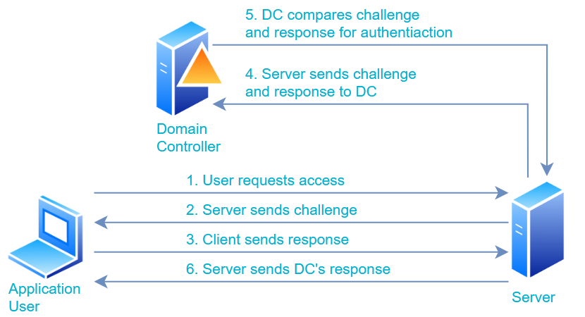

### Brute-force Login Attacks

THM provided us with a list of usernames discovered during a Red Team OSINT exercise.
From this exercise we know the list of users and that the initial onboarding password is "Changeme123". They also provided NTLM password spray python script.

The following is a usage example:

`python ntlm_passwordspray.py -u <userfile> -f <fqdn> -p <password> -a <attackurl>`

We provide the following values for each of the parameters:

* `<userfile>` - Textfile containing our usernames - "usernames.txt"
* `<fqdn>` - Fully qualified domain name associated with the organisation that we are attacking - "za.tryhackme.com"
* `<password>` - The password we want to use for our spraying attack - "Changeme123"
* `<attackurl>` - The URL of the application that supports Windows Authentication - `http://ntlmauth.za.tryhackme.com`

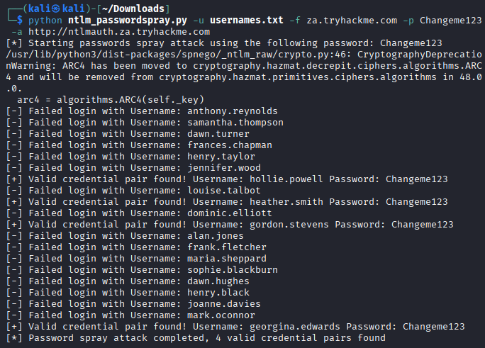

### NTLM and NetNTLM Task Questions

Q1:What is the name of the challenge-response authentication mechanism that uses NTLM?

A1: **NetNTLM**

Q2: What is the username of the third valid credential pair found by the password spraying script?

A2: **gordon.stevens**

Q3: How many valid credentials pairs were found by the password spraying script?

A3: **4**

Q4: What is the message displayed by the web application when authenticating with a valid credential pair?

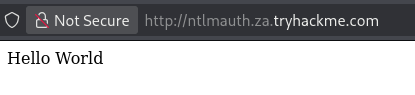

A4: **Hello World**

## 🔗 LDAP

LDAP, short for Lightweight Directory Access Protocol, is an authentication mechanism similar to NTLM. But it is the application that verifies the user's credentials. It is a popular mechanisms along non-Microsoft applications that integrate with Active Directory. Some of those applications are:

* Gitlab
* Jenkins
* Custom-developed web applications
* Printers
* VPNs

Here we have a presentation of the authentication via LDAP

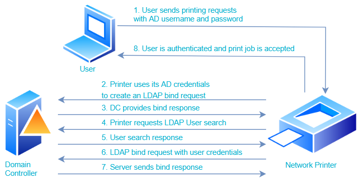

### LDAP Pass-back Attacks

This is a common attack targeting network devices, such as printers, after an attacker has obtained initial access to an internal network—for example, by connecting a rogue device in a boardroom.

Pass-back attacks can be executed once access to a device’s configuration has been obtained, where relevant parameters are defined. For instance, this may involve the web interface of a network printer. In many cases, the credentials for such interfaces remain set to default values, such as `admin:admin` or `admin:password`. Although the LDAP credentials cannot typically be extracted directly—because the password field is usually obscured—the configuration itself can still be modified. Specifically, an attacker may alter the LDAP server’s IP address or hostname. In an LDAP pass-back attack, this value is changed to the attacker’s own system. When the LDAP configuration is subsequently tested, the device attempts to authenticate against the rogue server, allowing the attacker to intercept the request and capture the LDAP credentials.

### LDAP Pass-back Lab

We will navigate to [http://printer.za.tryhackme.com/settings](http://printer.za.tryhackme.com/settings) where we can find settings, but note that we obtained username but not the password

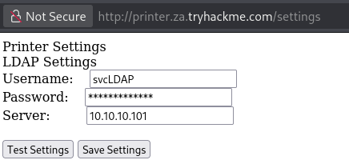

We will try to instruct the printer to connect to our machine so it would disclose the credentials. We start with nc -lvnp 389 (since 389 is a default LDAP port). Next we set server to our IP and test the connection.

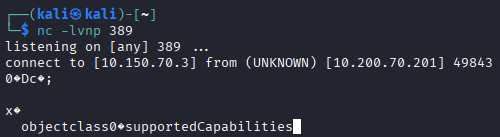

The `supportedCapabilities` response indicates a fundamental issue. Before transmitting credentials, the printer attempts to negotiate the parameters of the LDAP authentication method. Through this negotiation, it selects the most secure authentication mechanism mutually supported by both the printer and the LDAP server. If the chosen method enforces a high level of security, the credentials will not be transmitted in cleartext; in some cases, certain authentication mechanisms prevent credential transmission over the network entirely. Consequently, conventional tools such as Netcat cannot be used to capture these credentials. To address this limitation, it is necessary to deploy a rogue LDAP server configured with weaker security settings to ensure that credentials are transmitted in plaintext.

### A Rogue LDAP Server

Our server will be set up using OpenLDAP
We start from `sudo dpkg-reconfigure -p low slapd` and we use the following configuration

* DNS domain name: `za.tryhackme.com`
* Organization name: `za.tryhackme.com`
* Administrator password: `kali`
* Database backend to use: `MDB`
* Database removed when slapd is purged: `No`
* Move old database?: `Yes`

Now we need to downgrade our authentication mechanisms, so our server reports that it is only supporting PLAIN and LOGIN authentication methods.

We need to create `.ldif` file with the following content

```ldif
#olcSaslSecProps.ldif
dn: cn=config
replace: olcSaslSecProps
olcSaslSecProps: noanonymous,minssf=0,passcred
```

> The file has the following properties:
>
> * olcSaslSecProps: Specifies the SASL security properties
> * noanonymous: Disables mechanisms that support anonymous login
> * minssf: Specifies the minimum acceptable security strength with 0, meaning no protection.

Now we run `sudo ldapmodify -Y EXTERNAL -H ldapi:// -f ./olcSaslSecProps.ldif && sudo service slapd restart` and verify new authentication methods using `ldapsearch -H ldap:// -x -LLL -s base -b "" supportedSASLMechanisms`

### Capturing Credentials

With the same setup on our printer we execute `sudo tcpdump -SX -i breachad tcp port 389` and press "Test Settings" to get credentials in plaintext.

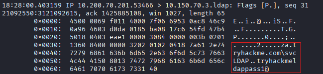

### LDAP Task Questions

Q1: What type of attack can be performed against LDAP Authentication systems not commonly found against Windows Authentication systems?

A1: **LDAP Pass-back Attack**

Q2: What two authentication mechanisms do we allow on our rogue LDAP server to downgrade the authentication and make it clear text?

A2: **LOGIN, PLAIN**

Q3: What is the password associated with the svcLDAP account?

A3: **tryhackmeldappass1@**

## 🧠 Authentication Relays

In Microsoft Windows there is a wide variety of services communicating with one another, allowing users to use services provided via network. Most of these services contain built-in authentication methods. We will focus on NetNTLM authentication used by SMB.

### Server Message Block

Server Message Block (SMB) is a Windows protocol used for file sharing, printer sharing, and remote administration, but it is also one of the most historically exploited protocols due to its deep integration into Windows systems and its exposure to network-based attacks.
In this lab we will take a deep dive into two exploits for NetNTLM authentication with SMB.

### LLMNR, NBT-NS and WPAD

We will use Responder to attempt to intercept the NetNTLM in order to crack it. Responder will help us to perform Man-in-the-Middle attack by poisoning the responses during NteNTLM authentication. It will try to poison any Link-Local Multicast Name Resolution (LLMNR), NetBIOS Name Service (NBT-NS) and Web Proxy Auto-Discovery (WPAD).

The protocols presented above rely on requests broadcaster on the local network, so rou attacking machine will also receive them. In the normal case those not meant for our host would be simply dropped. However our Responder will in response tell the requesting host, that our IP it the one addressed in the broadcast.

### NetNTLM Challenge: Interception

In our lab is running simulated authentication request that can be poisoned that runs every 30 minutes. This means that we may have to wait a bit before we can intercept the NetNTLM challenge and response.

We will execute `sudo responder -I breachad -v` and wait for results.

After a while we got a response which looks like this

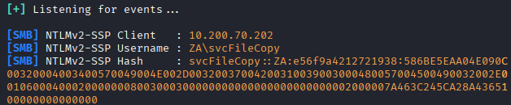

We can wait for more results or try to crack this one using hashcat. The cracked hash is in fact a set of credentials for breaching AD.

### Relaying the Challenge

In certain cases, it is possible to extend this approach by attempting to relay the challenge rather than merely capturing it. This process is more complex, particularly in the absence of prior knowledge about the accounts involved, as the success of the attack depends on the permissions associated with those accounts. Several conditions must be satisfied for this approach to be effective:

* SMB signing must either be disabled or enabled without enforcement. During a relay attack, minor modifications are made to the request before it is forwarded. If SMB signing is enforced, it becomes impossible to forge a valid message signature, resulting in the server rejecting the request.

* The associated account must possess sufficient permissions on the target server to access the requested resources. Ideally, the attacker seeks to relay the challenge-response authentication of an account with administrative privileges, thereby enabling initial access to the host.

* In the absence of an established foothold in Active Directory (AD), some degree of uncertainty is unavoidable regarding which accounts have permissions on specific hosts. If AD had already been compromised, preliminary enumeration could be conducted to identify these permissions, which is typically the case in practice.

Consequently, blind relay attacks are generally considered inefficient. A more effective strategy involves first compromising AD through alternative means, followed by enumeration to determine the privileges associated with the compromised account. This information can then be leveraged to facilitate lateral movement and privilege escalation across the domain. Nevertheless, it remains important to understand the fundamental mechanics of relay attacks, as illustrated in the diagram below.

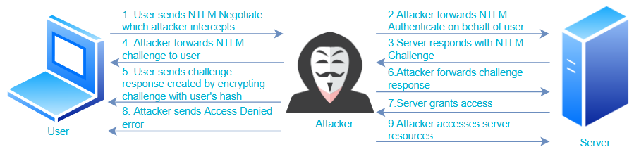

### Authentication Relays Task Questions

Q1: What is the name of the tool we can use to poison and capture authentication requests on the network?

A1: **responder**

Q2: What is the username associated with the challenge that was captured?

A2: **svcFileCopy**

Q3: What is the value of the cracked password associated with the challenge that was captured?

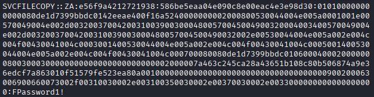

A3: **FPassword1!**

## ⚙️ Microsoft Deployment Toolkit

Microsoft Deployment Toolkit (MDT) is a Microsoft service designed to automate the deployment of Microsoft operating systems. Large organizations use tools such as MDT to deploy new system images across their infrastructure more efficiently, as base images can be centrally maintained and updated.

MDT is typically integrated with Microsoft System Center Configuration Manager (SCCM), which is responsible for managing updates for Microsoft applications, services, and operating systems. While MDT facilitates new deployments, it enables IT teams to preconfigure and manage boot images. As a result, when provisioning a new machine, a simple network connection allows the deployment process to proceed automatically. Additionally, boot images can be customized to include default software—such as Office 365 and organizational antivirus solutions—and to ensure that systems are fully updated upon initial installation.

### System Center Configuration Manager

SCCM can be considered an extension of MDT, offering more comprehensive management capabilities. It handles post-deployment tasks, particularly patch management, by allowing IT teams to monitor and review available updates across the entire infrastructure. Furthermore, updates can be tested within a sandbox environment to verify stability before being deployed centrally to all domain-joined machines. This significantly reduces the administrative burden on IT teams.

However, centralized management tools such as MDT and SCCM may also present attractive targets for attackers seeking to compromise critical infrastructure components. Although MDT supports multiple configurations, this discussion focuses specifically on the Preboot Execution Environment (PXE) boot configuration.

### PXE Boot

Large organizations utilize PXE boot to enable newly connected devices to load and install an operating system directly over a network connection. MDT can be employed to create, manage, and host PXE boot images. PXE boot is typically integrated with DHCP; consequently, when a device is assigned an IP address lease, it is permitted to request a PXE boot image and initiate the network-based installation process. The communication flow is illustrated in the diagram below:

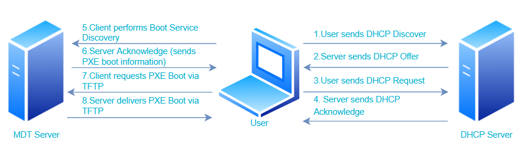

#### PXE Boot Image Retrieval

The first piece of information we need to gather is the IP address of the MDT server. In our case it is: `10[.]200[.]70[.]202`

The second piece of information is the `.BCD` filenames.

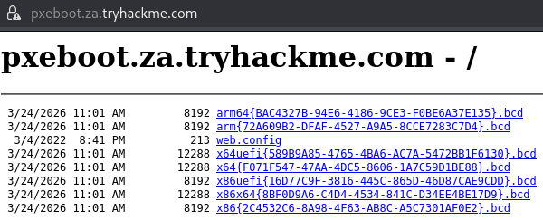

In a real-world scenario we would use TFTP to request all of the BCD files and enumerate the configurations. But in our study we will focus on the x64 architecture BCD file.

We will connect to one of the hosts provided for the time of this task and copy powershell script

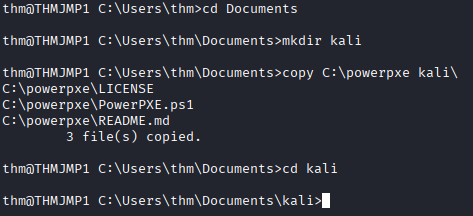

Now we need to download configuration file for our Boot Image

`tftp -i 10.200.70.202 GET "\Tmp\x64{F071F547-47AA-4DC5-8606-1A7C59D1BE88}.bcd" conf.bcd`

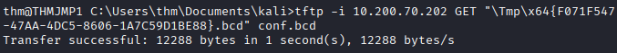

With the BCD file now recovered, we will use previously copied powerpxe to read its contents. Powerpxe is a PowerShell script that automatically performs this type of attack but usually with varying results, so it is better to perform a manual approach. We will use the Get-WimFile function of powerpxe to recover the locations of the PXE Boot images from the BCD file:

```powershell
powershell -executionpolicy bypass
Import-Module .\PowerPXE.ps1
$BCDFile = "conf.bcd"
Get-WimFile -bcdFile $BCDFile
```

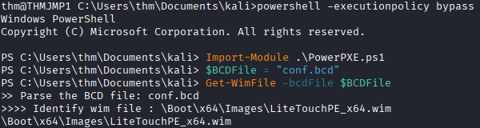

Now we have the location of the PXE Boot Image, so we use TFTP to download it.

`tftp -i 10.200.70.202 GET "\Boot\x64\Images\LiteTouchPE_x64.wim" pxeboot.wim`

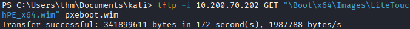

#### Recovering Credentials from a PXE Boot Image

The last stage is to exfiltrate credentials ou of downloaded PXE Boot image. One way of doint it is to inject a local administrator user, so we can automatically gain admin access as soon as the machine boots.

In our example we will use **powerpxe** but it is possible to do this step manually. Powerpxe will recover the credentials out of the bootstrap file.

We just need to execute `Get-FindCredentials -WimFile pxeboot.wim`

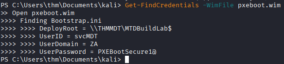

#### Questions

Q1: What Microsoft tool is used to create and host PXE Boot images in organizations?

A1: **Microsoft Deployment Toolkit**

Q2: What network protocol is used for recovery of files from the MDT server?

A2: **TFTP**

Q3: What is the username associated with the account that was stored in the PXE Boot image?

A3: **svcMDT**

Q4 :What is the password associated with the account that was stored in the PXE Boot image?

A4: **PXEBootSecure1@**

## 📂 Configuration Files

If we are fortunate enough to gain access to a host on the organization's network. We can try to recover AD credentials out of configuration files. A few examples of such files include:

* Web application config files
* Service configuration files
* Registry keys
* Centrally deployed applications

We could use enumeration scripts that will automate this process.

### Configuration File Credentials

In this exercise we will focus on the last type from the mentioned above files, the centrally deployed application. One of many examples of this type of applications would be McAfee Enterprise Endpoint Security, which companies can use as the endpoint detection and response tool.

McAfee stores credentials during the installation process so it can connect back to the orchestrator. Database can be retrieved with local access to the host. Typical storage path would be `C:\ProgramData\McAfee\Agent\DB\ma.db`

Step one, we copy the `.db` file, to our system

`scp thm@THMJMP1.za.tryhackme.com:C:/ProgramData/McAfee/Agent/DB/ma.db .`
Step two, we view the database with `sqlitebrowser ma.db` and under `AGENT_REPOSITORIES` table:

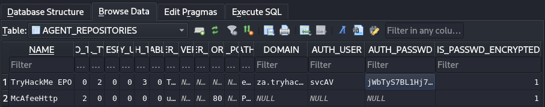

The fields of interest are: `DOMAIN`, `AUTH_USER`, and `AUTH_PASSWD`. The last one as we can see is encrypted, but the McAfee encryption key is known so we can use [Python3 password decryption tool for the McAfee](https://github.com/funoverip/mcafee-sitelist-pwd-decryption) to obtain it.

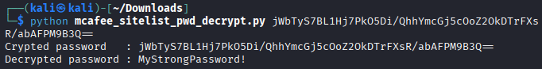

### Microsoft Deployment Toolkit Task Questions

Q1: What type of files often contain stored credentials on hosts?

A1: **Configuration Files**

Q2: What is the name of the McAfee database that stores configuration including credentials used to
connect to the orchestrator?

A2: **ma.db**

Q3: What table in this database stores the credentials of the orchestrator?

A3: **AGENT_REPOSITORIES**

Q4: What is the username of the AD account associated with the McAfee service?

A4: **svcAV**

Q5: What is the password of the AD account associated with the McAfee service?

A5: **MyStrongPassword!**

## 📝 Active Directory Breaching Conclusion

This study has demonstrated the process of breaching Active Directory environments by leveraging multiple attack vectors, including NTLM-based authentication attacks, LDAP misconfigurations, authentication relays, deployment infrastructure weaknesses, and insecure configuration files. The findings highlight that initial access is often achieved through relatively simple techniques, such as credential harvesting or misconfigured services, which can subsequently be expanded into broader domain compromise through enumeration and lateral movement. Ultimately, the security of Active Directory environments depends not only on robust configurations but also on the proper management of credentials and network services.

### Proposed Mitigations

To reduce the risk of the attacks discussed, the following mitigations are recommended:

* Enforce SMB Signing
Prevents NTLM relay attacks by ensuring message integrity and authenticity.
* Disable LLMNR, NBT-NS, and WPAD
Reduces the risk of credential interception via poisoning attacks (e.g., Responder).
* Implement Strong Password Policies
Enforce complex, unique passwords and eliminate default or weak credentials to mitigate password spraying attacks.
* Use Multi-Factor Authentication (MFA)
Adds an additional layer of security, significantly reducing the effectiveness of credential theft.
* Secure LDAP Communications
Enforce LDAPS and strong authentication mechanisms to prevent pass-back and credential exposure attacks.
* Restrict and Monitor NTLM Usage
Where possible, replace NTLM with Kerberos and audit NTLM authentication events.
* Harden Configuration Files and Secrets Management
Avoid storing credentials in plaintext or reversible formats; use secure vaulting solutions.
* Secure MDT and PXE Infrastructure
Restrict access to deployment services, encrypt sensitive data, and avoid embedding credentials in boot images.
* Network Segmentation and Least Privilege
Limit lateral movement by restricting access between systems and ensuring minimal required permissions.
* Continuous Monitoring and Logging
Detect suspicious authentication patterns, such as repeated login attempts or unusual relay behavior.

## 🧾 Active Directory Enumeration

### Credential Injection

After obtaining access to Active Directory credentials we open a whole new set of possibilities. We can enumerate various details about the Active Directory setup and structure. Even if our credential set grants us low-privileged access. We continue escalating privileges until our level of access is sufficient to achieve the defined objectives.

You can see a typical attack pattern on the diagram below.

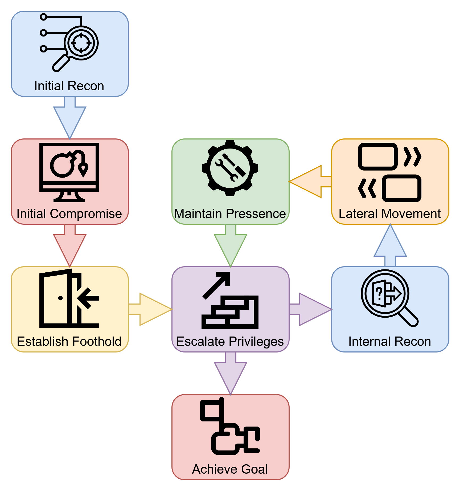

If you ever come into possession of Active Directory credentials, there is a strong possibility that you have no means to create a domain-joined machine. If those aforementioned credentials are in the format `user:password`, then we can use Runas, which is a Microsoft Windows binary, to inject those credentials into memory. The command syntax would look like this `runas.exe /netonly /user:<domain>\<username> cmd.exe`. Let us break down the added parameters.

* `/netonly`- Our machine is not domain-joined, and we want to inject credentials for network authentication and not authenticate against a domain controller. Therefore commands will run locally but network connections will occur using the specified account.
* `/user`- We need to provide the details of the domain and the username. Best practice is to provide the Fully Qualified Domain Name (FQDN) rather than just the NetBIOS name.
* `cmd.exe`- Once the credentials are injected, we run this binary to execute subsequent commands.

### It is always DNS

Once we provide the password and the command prompt window is opened, we need to verify that those credentials are valid. The best way to do this is to list the SYSVOL directory. This directory exists on all domain controllers and is available to any account regardless of privilege level.

Main function of the SYSVOL folder is storing Group Policy Objects and information along with any other domain related scripts.

Before listing SYSVOL, we need to configure DNS.

Here is an example of small PowerShell script made for this purpose

```powershell
$dnsip = "<DC IP>"
$index = Get-NetAdapter -Name 'Ethernet' | Select-Object -ExpandProperty 'ifIndex'
Set-DnsClientServerAddress -InterfaceIndex $index -ServerAddresses $dnsip
```

We can check if DNS is working by executing `nslookup` and if all is correct we can read the SYSVOL

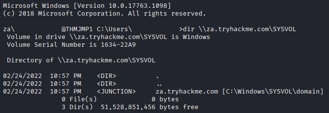

### IP vs Hostnames

There is a question that comes to mind. Is there a big difference between `dir \\<HOSTNAME>\SYSVOL` and `dir \\<DC IP>\SYSVOL`? Why setting the DNS?

There is a notable distinction, which stems from the authentication method employed. When a hostname is provided, network authentication initially attempts to use Kerberos. Because Kerberos relies on hostnames embedded within its tickets, supplying an IP address instead can compel the system to fall back to NTLM authentication. Although this distinction may not appear immediately significant, understanding these nuances is valuable, as it can facilitate more covert operations during a red team assessment. In certain cases, organizations may actively monitor for OverPass-the-Hash and Pass-the-Hash attacks. In such contexts, deliberately forcing NTLM authentication can serve as an effective technique for evading detection.

## 🧾 Enumeration through MMC

In this section, we will examine the first enumeration method. We will make use of the Microsoft Management Console (MMC) with the Remote Server Administration Tools' (RSAT) Active Directory Snap-Ins.

After running MMC we want to add AD Snap-ins

* Active Directory Domains and Trusts
* Active Directory Sites and Services
* Active Directory Users and Computers

### Active Directory Users and Computers

This consists of initial Organisational Units (OU). In the People directory we can see users divided according to the department OUs. Clicking each department will show users who belong to that department.

We can also find hosts in the environment. Both Servers and Workstations show a list of domain-joined machines.

With appropriate permissions, we could use MMC to make changes to AD such as changing a user's password or adding an account to a specific group.

### Pros and Cons of Enumeration Through MMC

Pros:

* GUI provides great method to gain view of the Active Directory environment.
* Fast searching of the Active Directory objects.
* Direct method to view updates of the Active Directory objects.
* Possibility to change and add new objects, with sufficient privileges.

Cons:

* The GUI requires Remote Desktop Protocol access to the machine.
* Gathering Active Directory-wide properties or attributes cannot be performed.

### Lab questions

Q1: How many Computer objects are part of the Servers OU?

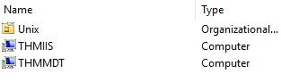

A1: **2**

Q2: How many Computer objects are part of the Workstations OU?

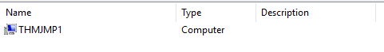

A2: **1**

Q3: How many departments (Organisational Units) does this organisation consist of?


A3: **7**

Q4: How many Admin tiers does this organisation have?

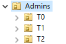

A4: **3**

Q5: What is the value of the flag stored in the description attribute of the t0_tinus.green account?

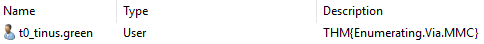

A5: **THM{Enumerating.Via.MMC}**

## 💻 Enumeration through Command Prompt

CMD have the advantage of built-in command useful for the purpose of enumerating AD, namely `net`.

### Users

Executing `net /user domain` will return all of the Active Directory users. We can enumerate deeper for a more detailed information about the user with `net user <USERNAME> /domain`. This can also provide us with group memberships. But if user is a part of more then ten groups, then this command will fail to list them.

### Groups

Same like with users, we can enumerate groups of the domain. In this case we need to use `net group /domain`. This in combination with `net group "<NAME_OF_THE_GROUP>" /domain` can lead us to target of our goal execution.

### Password Policy

Another usage of the aforementioned command is `net accounts /domain`. This will provide us with useful information such as:

* Length of password history maintained: How many unique passwords are kept, to prevent user from reusing old passwords on change.
* Lockout threshold: How many inncorect password attempts would lead to account lockout.
* Minimum password length
* Maximum password age: How often password rotation is forced.

### Pros and Cons of Enumeration Through CMD

**Pros of Using the `net` Command**

* **Built-in and always available.** The net command is included by default in Windows, so it requires no installation and works even in restricted environments.
* **Useful for quick checks and reconnaissance.** Because it’s fast and built-in, it’s convenient for quick assessments or troubleshooting.

**Cons of Using the `net` Command**

* **Lacks advanced filtering or formatting.** Output is plain text and cannot be easily customized or filtered compared to PowerShell or specialized tools.
* **Not suitable for large-scale or automated enumeration.** It’s designed for manual use, making it inefficient for scripting or bulk data collection.
* **Provides only basic information.** The command cannot retrieve deeper AD attributes (e.g., email, OU location, last logon timestamps).
* **Older and less flexible than modern tools.** is a legacy utility and does not support modern AD querying capabilities like LDAP filters or PowerShell cmdlets.

### Lab Questions

Q1: Apart from the Domain Users group, what other group is the aaron.harris account a member of?

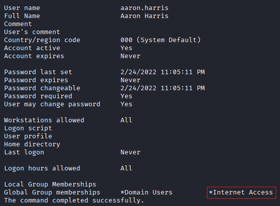

A1: **Internet Access**

Q2: Is the Guest account active? (Yay,Nay)

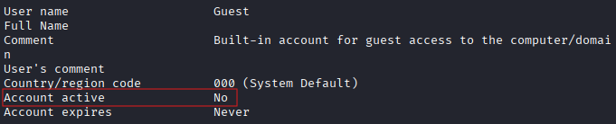

A2: **Nay**

Q3: How many accounts are a member of the Tier 1 Admins group?

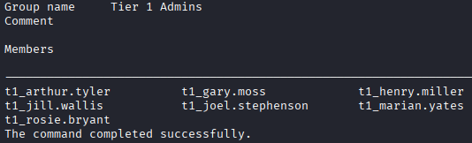

A3: **7**

Q4: What is the account lockout duration of the current password policy in minutes?

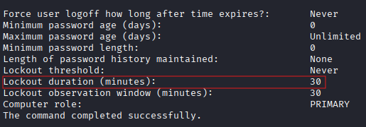

A4: **30**

## ⚡ Enumeration through PowerShell

It is not arcane knowledge that PowerShell is much more versatile and powerful tool than Command Prompt. The biggest advantage is a support of cmdlets which in a matter of fact are `.NET` classes.

### Users -cmdlet

We can enumerate users by using `Get-ADUser -Identity <USERNAME> -Server <SERVER_DOMAIN> -Properties *`

Lets walk through parameters used:

* Identity is the account name we are enumerating
* Server in this case we are pointing to domain controller but remember that in this lab we are not domain-joined.
* Properties will show properties bound to the account, with the usage of an asterisk, all of the properties will be listed.

Additionally we can help ourselves with the `-Filter` parameter and use `Format-Table` to display results in a more organized matter i.e., `Get-ADUser -Filter 'Name -like "*stevens"' -Server za.tryhackme.com | Format-Table Name,SamAccountName -A`

### Groups -cmdlet

Similarly, we would perform groups enumeration but this time applying the Get-ADGroup i.e., 'Get-ADGroup -Identity Administrators -Server za.tryhackme.com'. We can also enumerate group membership with usage of `Get-ADGroupMember`

### Active Directory Objects and Domains

A broader, more generic search for any Active Directory objects can be achieved through `Get-ADObject`.
To retrieve additional information about the domain we utilize `Get-ADDomain`.

### Altering Active Directory Objects

With usage of AD-RSAT cmdlets we are able to create or even alter existing Active Directory objects. Treat this just as a trivia, because we are entering Active Directory exploitation territory.

### Pros and Cons of Enumeration Through PowerShell

**Pros:**

* PowerShell cmdlets are capable of retrieving substantially more detailed information than traditional Command Prompt `net` commands.
* These commands can be executed against a specified server or domain by leveraging runas, even from a machine that is not joined to the domain.
* Custom cmdlets can be developed to extract targeted or highly specific information.
* AD-RSAT cmdlets enable direct modification of Active Directory objects, including tasks such as password resets or assigning users to particular groups.

**Cons:**

* PowerShell activity is more frequently monitored by defensive (blue) teams compared to Command Prompt usage.
* The use of PowerShell for enumeration may require installation of AD-RSAT tools or reliance on alternative scripts, both of which may increase the likelihood of detection.

### Lab Questions for PowerShell cmdlets

Q1:What is the value of the Title attribute of Beth Nolan (beth.nolan)?

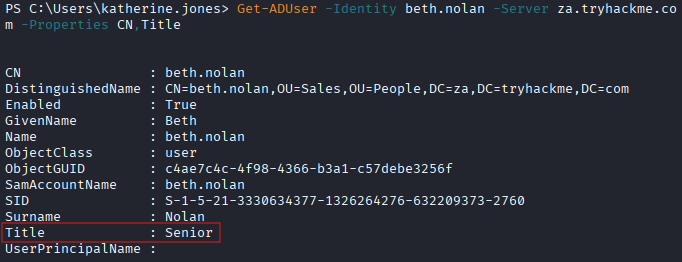

A1: **Senior**

Q2: What is the value of the DistinguishedName attribute of Annette Manning (annette.manning)?

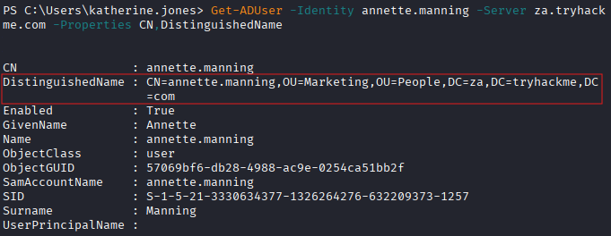

A2: **CN=annette.manning,OU=Marketing,OU=People,DC=za,DC=tryhackme,DC=com**

Q3: When was the Tier 2 Admins group created?

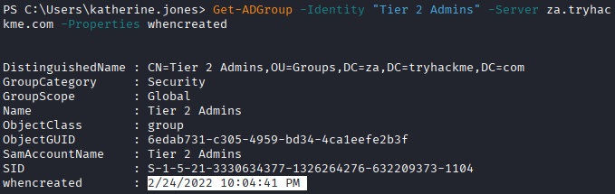

A3: **2/24/2022 10:04:41 PM**

Q4: What is the value of the SID attribute of the Enterprise Admins group?

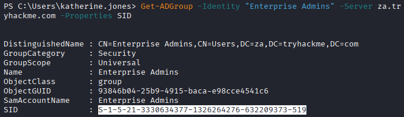

A4: **S-1-5-21-3330634377-1326264276-632209373-519**

Q5: Which container is used to store deleted AD objects?

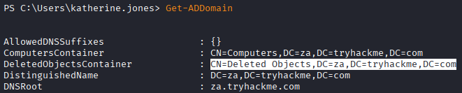

A5: **CN=Deleted Objects,DC=za,DC=tryhackme,DC=com**

## 🐕 Enumeration through Bloodhound

When considering BloodHound as an Active Directory (AD) enumeration tool, the most accurate description is that it is a graph-based recon tool showing the real privilege hierarchy in the AD domain, rather than what administrators believe exists. This is because BloodHound not only enumerates objects but shows their relationship and inheritance.

### Sharphoud

SharpHound is the enumeration part of the BloodHound suite, and recognizing the difference is important when trying to define what BloodHound is in the context of AD enumeration. SharpHound collects all of the pieces, and BloodHound puts together the puzzle.

There are three types of Sharphound Collectors:

* `Sharphound.ps1`- the script that runs the Sharphound. But in recent version of Sharphound, the authors have discontinued the release of the script version because it can be directly executed in memory, bypassing on-disk scans.
* `Sharphound.exe`- a Windows executable that runs Sharphound.
* `AzureHound.ps1`- a script used to run SharpHound for Microsoft cloud computing services, i.e., Azure. The collected data from Azure can be ingested by Bloodhound to discover attacks through the configuration of Azure Identity & Access Management.

If we were to utilize these collector scripts for our assessment purposes, the chances are quite high that these scripts will get flagged as malicious code. Here, our Windows machine that is not part of any domain environment becomes relevant. The runas command can help us inject our AD credentials and direct Sharphound towards a Domain Controller.

We will use the SharpHound.exe version for our enumeration as follows `Sharphound.exe --CollectionMethods <Methods> --Domain za.tryhackme.com --ExcludeDCs`

Let us walk though the parameters:

* **CollectionMethods**– Specifies whether Sharphound will gather data based on the Default option or the All option. Also, considering that Sharphound caches the data, after the initial run is complete, using the Session option as a collection method is possible to quickly obtain additional sessions for users.
* **Domain**– This parameter indicates the domain that needs to be enumerated. In certain cases, the need for enumerating the parent domain arises because the parent domain has a trust relationship with the current domain.
* **ExcludeDCs** – The task of this parameter is to prevent the domain controllers from being accessed by Sharphound, thereby lowering the risk of detection.

After collection is complete, Sharphound produces a `.ZIP` file, which can be ingested into BloodHound.

### Bloodhound

Bloodhound uses Neo4j as its backend database and graphing system, so before starting, we need to load Neo4j.
First `neo4j console start` next `bloodhound --no-sandbox`. Default credentials are `neo4j:neo4j`.

We need to get the file created by Sharphound using `scp <AD Username>@THMJMP1.za.tryhackme.com:C:/Users/<AD Username>/Documents/<Sharphound ZIP> .` and ingest it into Bloodhound. After importing the JSON files, we can begin analysis.

### Attack Paths

By selecting a user in the node search, we can obtain information from the following categories:

* Overview – Gives the number of active sessions for the account and whether it can target high-value systems.
* Properties - Provides information regarding the AD account, like display name and account title.
* Additional Properties – Provides more detailed AD information including the distinguished name and creation time.
* Group Membership – Provides information regarding the groups the account is associated with.
* Local Administrative Privileges – Provides information about hosts in which the AD account has been assigned administrative access rights.
* Execution Privileges – Provides information about the privileges possessed by the AD account, such as RDPing into machines.
* Outbound Control Privileges – Provides information on AD objects where the AD account has control rights to alter the attributes.
* Inbound Control Privileges – Provides information on AD objects that can change attributes for the AD account.

Let us analyze Nodes (icons) and Edges (lines) on the graph below

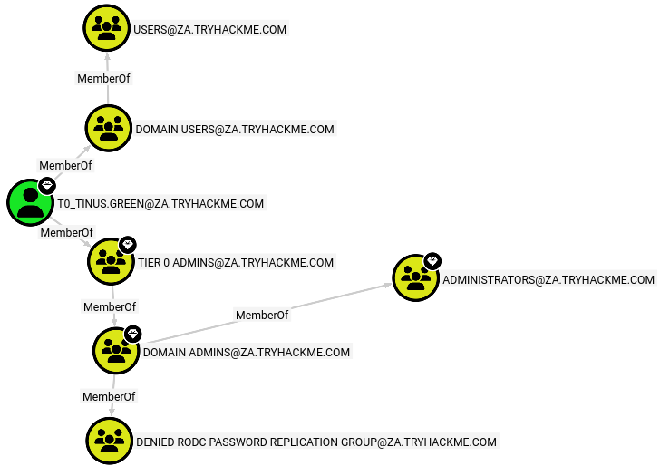

We have a user with the account name **T0_TINUS.GREEN**, that is a member of the group **TIER 0 ADMINS**, and that group is nested within the **DOMAIN ADMINS** group. That means, all the users that are part of the **TIER 0 ADMINS** are also **DOMAIN ADMINS**.

From here we can find out by viewing members of **DOMAIN ADMINS**, that there is another account called **ADMINISTRATOR**. But this is a built-in account, so we will focus on the user instead.

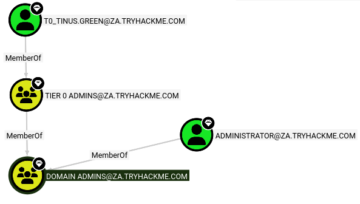

We can enumerate the attack path by using pathfinding tool. As our start node we will set our Active Directory username, and our end node will be the **TIER 1 ADMINS**

If there is no available attack path using the selected edge filters, Bloodhound will display "No Results Found" If the path was found we present THM's example to exploit that knowledge

> We could do something like the following to exploit this path:
>
> * Use our AD credentials to RDP into THMJMP1.
> * Look for a privilege escalation vector on the host that would provide us with Administrative access.
> * Using Administrative access, we can use credential harvesting techniques and tools such as Mimikatz.
> * Since the T1 Admin has an active session on THMJMP1, our credential harvesting would provide us with the NTLM hash of the associated account.

### Session Data Only

The AD structure does not change significantly in large organizations. It is possible that there might be one or two new members, but the structure of Organizational Units, Groups, Users, and permissions remains unchanged.

However, the elements that change frequently are active sessions and LogOn events. As Sharphound is only capable of capturing a snapshot of the AD structure at a certain point in time, the data for active sessions can become outdated, as some of the users would have already logged out or logged into new sessions.

Another recommendation is to run Sharphound using the "All" collection method at the beginning of your assessment and then run Sharphound twice each day using the "Session" collection method. This way, you will be able to obtain fresh session information and these collection runs will be faster because there will be no enumeration of the whole AD environment. The most appropriate times for such session runs are about 10:00, when people drink their first coffee and begin their work and 14:00 when they come back from lunch but are not yet ready to leave.

One can easily remove outdated session information in Bloodhound from the Database Info tab selecting the "Clear Session Information" option before importing new information from the session runs of Sharphound.

### Pros and Cons of Enumeration Through Bloodhound

**Pros:**

* Offers a graphical user interface for Active Directory enumeration.
* Enables visualization of potential attack paths based on collected AD data.
* Delivers deeper insights into Active Directory objects that would typically require multiple manual queries to obtain.

**Cons:**

* Requires the execution of SharpHound, which is relatively noisy and may be detected by antivirus (AV) or endpoint detection and response (EDR) solutions.

### Bloodhound Lab Questions

Q1: What command can be used to execute Sharphound.exe and request that it recovers Session information only from the za.tryhackme.com domain without touching domain controllers?

A1: **SharpHound.exe --CollectionMethods Session --Domain za.tryhackme.com --ExcludeDCs**

Q2: Apart from the krbtgt account, how many other accounts are potentially kerberoastable?

We need to query:

```cypher
MATCH (u:User)
WHERE u.hasspn = true
RETURN u
```

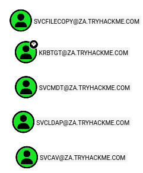

A2: **6**

Q3: How many machines do members of the Tier 1 Admins group have administrative access to?

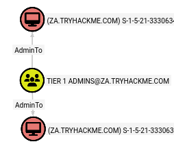

A3: **2**

Q4: How many users are members of the Tier 2 Admins group?

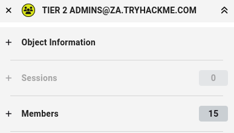

A4: **15**

## 📑 Active Directory Enumeration Conclusion

Active Directory enumeration is a foundational phase in understanding how identities, permissions, and relationships operate within a Windows domain. Even low‑privileged credentials can reveal valuable structural information, including users, groups, policies, and trust relationships. Tools such as MMC, built‑in Windows commands, PowerShell cmdlets, and graph‑based platforms like BloodHound provide different perspectives on the same environment. Together, they highlight how complex and interconnected AD ecosystems are, and how misconfigurations or excessive privileges can create unintended pathways to sensitive assets. Because AD environments evolve slowly while session data changes frequently, continuous and structured enumeration is essential for maintaining an accurate picture of identity and access behavior.

### Proposed Mitigations for the Presented Techniques of AD Enumeration

* Enforce strong authentication policies, including complex passwords and regular rotation.
* Limit the use of legacy authentication protocols, such as NTLM, where possible.
* Apply the principle of least privilege to users, groups, and service accounts.
* Regularly audit group memberships, nested groups, and privileged accounts.
* Monitor for unusual authentication activity, including abnormal Kerberos or NTLM usage.
* Restrict access to administrative tools such as RSAT and MMC to authorized personnel.
* Segment high‑value accounts and systems into hardened administrative tiers.
* Protect domain controllers and administrative workstations with strict access controls.
* Monitor for suspicious directory queries or enumeration patterns.
* Keep domain controllers, management tools, and AD‑related services updated.
* Conduct periodic reviews of AD configurations, trust relationships, and delegation settings.
* Reduce the exposure of unnecessary AD information by tightening ACLs on sensitive objects.

This concludes our exploration of this topic. Thank you for following through to the end. See you in the next one. 👋
