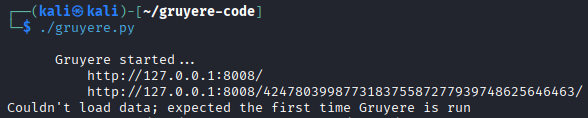
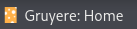
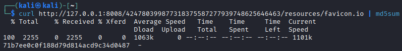
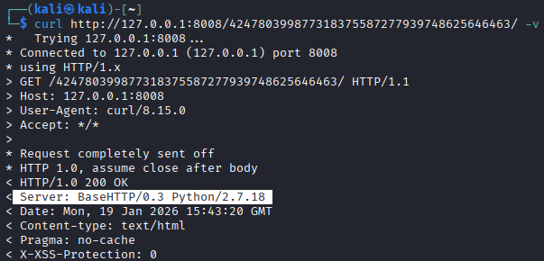

# Walking a page

One of the simplest way (but not always successful) to identify vulnerability is to walk all of the visible pages of a working app.

## 📝 Preparations

For this repo I'm going to run Google Gruyere which is Python based app with great umber of vulnerabilities such as:

* Cross-site scripting (XSS)
* Cross-site request forgery (XRF)
* Remote code execution
* DoS attacks
* Information disclosure

You can find more about it right here <https://google-gruyere.appspot.com/#0__gruyere>

I will be running my instance locally on kali VM

We have few in-built browser tool that can assist us with the task.

* View page source - will display readable html code of web page
* Inspect - opens structured view of code, highlited on the element, that we choose to "inspect" Within this there are some notable tabs:
  * Debugger - we can inspect and control the flow of JavaScript on page
  * Network - we can see network requests.

## 🚶‍♂️‍➡️Exploring

|Feature|URL|Summary|
|---|---|---|
|Home|/|Gets us to main page|
|Sign in|/login|Displays login form with two text fields and a "login" button.|
|Sign up|/newaccount.gtl|Shows page, where we can enter desired user name and password thus creating an account|
|All snippets for "Cheddar Mac"|/snippets.gtl?uid=cheddar|shows us snippets about Cheddar Mac and a link to Mac's homepage|
|All snippets for "Brie"|/snippets.gtl?uid=brie|Displays same as above but for brie|
|Homepage|<https://images.google.com/?q=cheddar+cheese> / <https://news.google.com/news/search?q=brie>|Links to Brie and Cheddar Mac homepages|

## 🔎 Content Discovery

While exploring web page we can also look for content such as files, videos, pictures, backup or website feature.

### 🤖 Robots.txt

robots.txt is a file containing instructions for search engines indexing bots, crawling the website. Common practice is restricting certain areas, so they won't be displayed in search engines results. It can be valuable information for pentester since those locations don't have visible links on the page.

### 🗺️ Sitemap.xml

this document stands of opposition to robots.txt. It contains list of pages which owner wants to be indexed and viewed in the search results. Even if the website changes this file can still contain vital information.

### 🖼️ Favicon

Favicon is a small picture displayed near site name. 

When unchanged it can lead to the information about used framework. All we need to do is simply get the md5 hash value of it and compare with database for example on the [OWASP wiki](https://wiki.owasp.org/index.php/OWASP_favicon_database).

### 🗿 HTTP Headers

In response of sending request to web server it returns various HTTP Headers. These can contain useful informations such as programming or scripting languages and webserver software.

Now we know that Gruyere's web app runs on BaseHTTP web server version 0.3 and is written in Python 2.7.18. Using that knowledge we could find if there are some vulnerabilities that we can exploit.

## 🕵️OSINT

**WIP...**