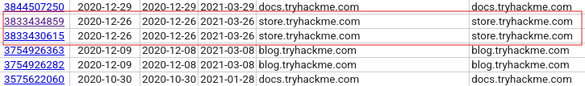
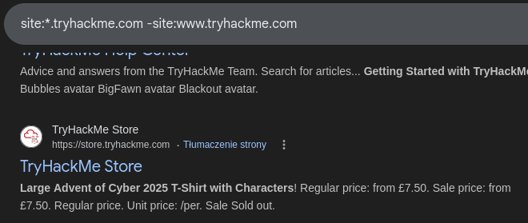
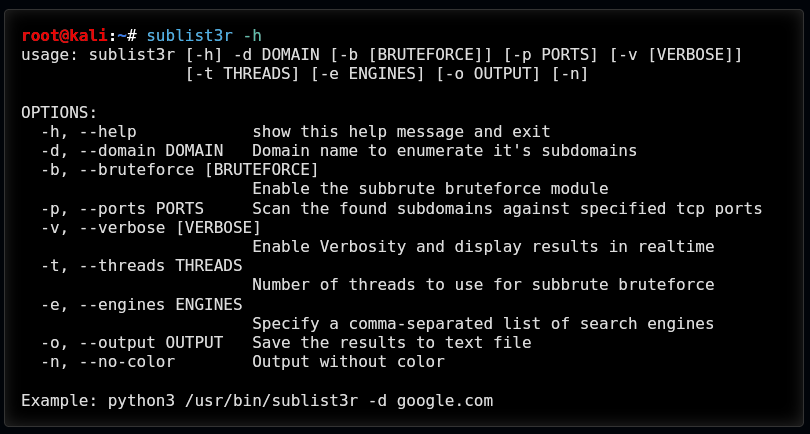
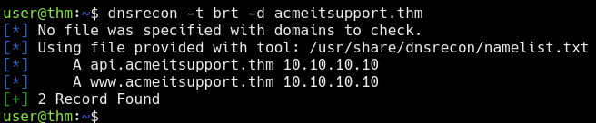
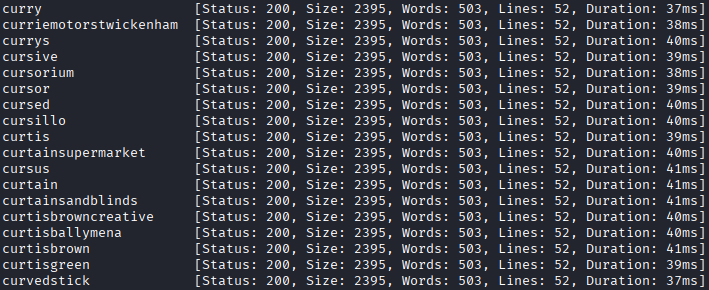
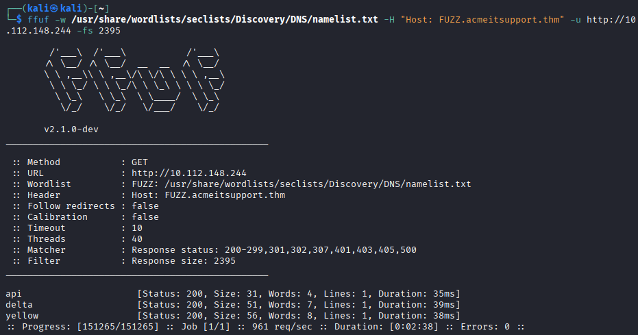

# Subdomain Enumeration 🌐

This is the process of finding valid subdomains for a domain. The main purpose of this process is to discover additional potential points of entry.

In this write-up we will explore three different enumeration methods:

- OSINT
- Brute Force
- Virtual Host

This write-up is based on a TryHackMe room.

## OSINT 🔎

### SSL/TLS Certificates 🔐

A Certificate Authority (CA) participates in what is known as “Certificate Transparency logs.” This is a process of creating publicly available logs of every SSL/TLS certificate issued for a domain. The idea behind it is to stop malicious certificates from being used. Sites such as [crt.sh](https://crt.sh/) allow us to use CT logs to our advantage and discover subdomains that belong to a domain. It also shows historical results.

#### Q: What domain was logged for tryhackme.com on crt.sh at 2020-12-26?

**Answer:** store.tryhackme.com

### Search Engines 🔍

By using specific filters in our search, we can identify additional subdomains. On Google we can use `site: filter`. For example `site:*.domain.com -site:www.domain.com`. This will lead to results that contain only subdomains belonging to domain.com.

#### Q: What is the TryHackMe subdomain beginning with S discovered using the above Google search?

**Answer:** store.tryhackme.com

### Sublist3r 🛠️

In the process of OSINT subdomain enumeration, we can automate tasks with the help of a tool such as [Sublist3r](https://www.kali.org/tools/sublist3r/).

## DNS Bruteforce 💣

This method is simply trying possible subdomains from pre-made list of commonly used subdomains. One of the tools we can use is dnsrecon.

## Virtual Hosts 🖥️

Some subdomains are not publicly hosted but are kept on a private DNS server or recorded on the developer’s machines in either `/etc/hosts` file or c:\windows\system32\drivers\etc\hosts file.

Web servers determine which website users are attempting to access based on the Host header. We can use this header to analyze responses and identify new websites.

This also can be automated, just like DNS Bruteforce with a wordlist. Our tool of choice will be ffuf (Fuzz Faster U Fool).

`ffuf -w /usr/share/wordlists/SecLists/Discovery/DNS/namelist.txt -H "Host: FUZZ.acmeitsupport.thm" -u http://10.112.148.244`

Let's walk through used switches.

- `-w` is used to specify path to wordlist
- `-H` adds or edits header. We are using aforementioned Host header
- `-u` specifies target URL

As you can see the above command will always report a valid result, so we need to somehow filter output. One of the ways to accomplish this is by using the `-fs` switch. It is an HTTP response size filter. We will add `-fs 2395`

### Q; What is the first subdomain discovered?

Although the first discovered subdomain was **api**, the correct **answer is:** delta

### Q: What is the second subdomain discovered?

**Answer is:** yellow

## Final thoughts

We barely scratched the surface, but sometimes it is all we need to find that misconfigured interface or unsecured page.
