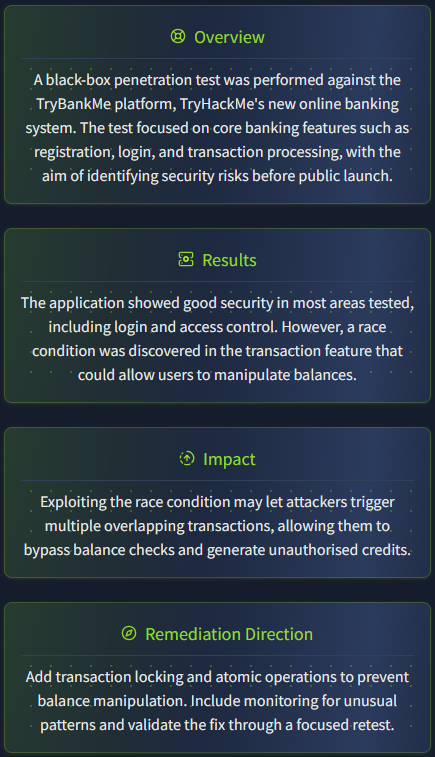

# 📖 Pentest Report Guide

## ❓ Why Write a Pentest Report

- Document findings and vulnerabilities discovered during testing
- Provide evidence of security assessment completion
- Communicate risk levels to stakeholders
- Create actionable remediation recommendations
- Establish baseline for future security audits
- Comply with regulatory requirements and contractual obligations

## ❓ To Whom to Write

- **Executive Leadership** – High-level summary of risks and business impact
- **IT/Security Teams** – Detailed technical findings and remediation steps
- **Compliance Officers** – Regulatory alignment and audit requirements
- **Project Stakeholders** – Scope coverage and testing methodology

## ❓ How to Write a Pentest Report

### Structure
1. **Executive Summary** – Overview, key risks, high-impact findings
2. **Methodology** – Testing scope, approach, tools used, timeline
3. **Risk Rating** – Severity classification (Critical, High, Medium, Low)
4. **Findings** – Detailed vulnerability descriptions with evidence
5. **Remediation** – Specific steps to fix each issue, prioritized
6. **Appendices** – Screenshots, logs, technical details

Points 2–5 can be consolidated into a single category called “Vulnerability Write-Up.”

### 🎖️ Best Practices
- Use clear, non-technical language for executives
- Include CVSS scores or custom risk ratings
- Provide proof-of-concept details for developers
- Prioritize findings by business impact
- Make recommendations specific and implementable
- Review findings with the client before final delivery

### 🔦 Practical Notes

#### 📄 Summary Example

When writing a summary, one should use non-technical language or keep technical details to a minimum. An effective summary should address the following questions:

1. Why did we test?
2. What did we find?
3. What is the impact of our findings on the business or system?
4. What should be next steps?

Below you can see a summary example available in a [THM Room](https://tryhackme.com/room/writingpentestreports):



#### 📝 Vulnerability Write-Up

This is the most substantial part of the report. It should include technical details so that the receiving teams can understand what was found, how it was identified, and how it can be remediated. This section should address questions such as:

1. **Where was the vulnerability found?** Was it a parameter, a feature, on which endpoint?
2. **What is required for the vulnerability to be exploited?** Is it a specific set of credentials? Is it exploitable in certain workflow?
3. **How does it affect the environment?** Could it result in a confidential data leak? Could it allow a user to gain unauthorized access or privileges?
4. **What should be done to mitigate it?**

Below is an example of SQL injection based on an example shown in a [THM Room](https://tryhackme.com/room/writingpentestreports):

#### 📑 Example: Injection Vulnerability Report

**Title:** Unauthenticated Injection Vulnerability in Login Interface

**Risk Rating:** High (CVSS 3.1 Base Score: 8.6)

**Summary:**
An unauthenticated injection flaw was discovered within the login functionality of the TryBankMe application. This issue may enable an attacker to circumvent authentication mechanisms or retrieve sensitive user data.

**Background:**
Injection vulnerabilities arise when user-provided input is incorporated into queries without adequate parameterization. As a result, the interpreter cannot reliably distinguish between legitimate commands and malicious input, allowing attackers to manipulate query execution. Such vulnerabilities are frequently exploited to bypass authentication controls or extract confidential information.

**Technical Details and Evidence:**
The `/login` endpoint was found to be susceptible to SQL injection through the `username` parameter. Using Burp Suite, the following HTTP request was intercepted and altered:

```html
POST /login HTTP/1.1
Host: trybankme.com
Content-Type: application/x-www-form-urlencoded
Content-Length: 45
username=' OR 1=1--&password=randomvalue
```

The server responded with a 302 Found status, redirecting to the authenticated user dashboard:

```html
HTTP/1.1 302 Found
Location: /dashboard
Set-Cookie: sessionid=abc123xyz456; Path=/; HttpOnly
```
This behavior confirms that authentication controls were successfully bypassed using a standard SQL injection payload.

**Impact:**
Exploitation of this vulnerability allows attackers to gain unauthorized access to user accounts without valid credentials. Additionally, although the injection point appears to be blind, attackers may still exploit error-based techniques to extract information from the underlying database.

**Remediation Recommendations:**
All database interactions involving user input should utilize parameterized queries. For instance, in a .NET application using Microsoft SQL Server, the authentication query can be securely implemented as follows:

```C#
using (SqlConnection connection = new SqlConnection(connectionString))
{
  string query = "SELECT * FROM Users WHERE Username = @username AND Password = @password";
  SqlCommand command = new SqlCommand(query, connection);
  command.Parameters.AddWithValue("@username", inputUsername);
  command.Parameters.AddWithValue("@password", inputPassword);
  connection.Open();
  SqlDataReader reader = command.ExecuteReader();
  if (reader.HasRows)
  {
      // Authentication successful
  }
}

```
This approach ensures that user input is clearly separated from the SQL command, preventing the database engine from misinterpreting input as executable code.

#### 📎 Appendices

Despite differences in what appendices should be included in a report, there are two types that must always be included.

**Assessment Scope**
This appendix establishes how closely the assessment aligns with the original scope in the Rules of Engagement document. If, during a penetration test, only 75% of the scope was covered, then this appendix shows that the remaining 25% will require a reassessment.

**Assessment Artifacts**
This assessment lists all of the artifacts that were created during the tests and were not able to be removed from the system. A reverse shell could be one of the examples. If it was left behind it could pose a significant security threat. This appendix allows for the provision of recommendations on how those artifacts should be removed.

## 🏁 Conclusion

Producing professional penetration testing reports is as critical as identifying the vulnerabilities themselves. A clear, well-structured, and well-written report constitutes the final deliverable of the assessment and often serves as the only enduring record of the work performed.
